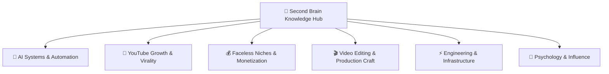

# 🧠 Second Brain Master Knowledge Mind Map & Fast Retrieval Map

> **Database Scope:** 56 structured knowledge cards, video transcripts, frameworks, and actionable notes.
> **Automated Cloud Sync:** Synced live with GitHub Actions repository `SecondBrainAutomation`.

---

## 🧭 High-Level Architecture Diagram

---

## ⚡ Instant Retrieval Protocol for Antigravity

Whenever a question is asked:

1. **Find Matching Node:** Scan the domain clusters below or run `python search_brain.py "<user query>"`.
2. **Inspect the Target Note:** Open the linked note file directly: `file:///f:/Second Brain Data/notes/...md`.
3. **Extract Exact Facts:** Pull the specific case study numbers, framework steps, tool names, or transcript quotes.
4. **Synthesize & Cite:** Combine the Second Brain insights with fresh research and cite the specific video/channel.

---

## 🤖 AI Systems & Automation (10 Videos)
*Autonomous workflows, LLM prompt architectures, video generation models, agent pipelines, and channel cloning techniques.*

| Video / Topic | Channel | Key Frameworks & Keywords | Note Link |
| :--- | :--- | :--- | :--- |
| **Test Video (kCc8FmEb1nY)** | Unknown | `Scaled Dot-Product Self-Attention, Decoder-Only Transformer Block Architecture, transformers, pytorch` | [Read Note](file:///f:/Second Brain Data/notes/2026/09/2026-09-07-test-video-kcc8fmeb1ny.md) |
| **How To Clone Any YouTube Channel With Claude AI (Full Automation)** | K4CREATES | `Channel Cloning System, Style DNA Extraction, ai, automation` | [Read Note](file:///f:/Second Brain Data/notes/2026/09/2026-09-09-how-to-clone-any-youtube-channel-with-claude-ai-full-automation.md) |
| **GPT-6 Astra Can Use Your Computer. This Changes Everything** | Vaibhav Sisinty | `Research-First Execution, Stop-and-Ask Rule, ai, agents` | [Read Note](file:///f:/Second Brain Data/notes/2026/09/2026-09-12-gpt-6-astra-can-use-your-computer-this-changes-everything.md) |
| **GPT-6 Astra Is Finally Here And It Can Now Use Your Laptop For You (+14 AI Updates)** | Vaibhav Sisinty | `Hybrid Compute Privacy Gate, Agentic Multi-Bot Orchestration, ai, agents` | [Read Note](file:///f:/Second Brain Data/notes/2026/09/2026-09-12-gpt-6-astra-is-finally-here-and-it-can-now-use-your-laptop-for-you-14-ai-updates.md) |
| **How I Generate $1000+ AI Motion Graphics With Google Antigravity (For FREE)** | The Solo Entrepreneur | `Motion Director Skill, Video-to-Template Pipeline, ai, motion graphics` | [Read Note](file:///f:/Second Brain Data/notes/2026/09/2026-09-12-how-i-generate-1000-ai-motion-graphics-with-google-antigravity-for-free.md) |
| **The Only Claude + Higgsfield Genjutsu Affiliate Marketing Tutorial You Need!** | Wealth Wisdom | `Objects Swap Workflow, Motion Transfer Technique, affiliate marketing, ai video` | [Read Note](file:///f:/Second Brain Data/notes/2026/09/2026-09-12-the-only-claude-higgsfield-genjutsu-affiliate-marketing-tutorial-you-need.md) |
| **This YouTube Ai Agent Posts Viral Video on YouTube on Auto Mode - Detailed Video Hindi Video** | AI Learners India | `8-Step Auto Viral Shorts Pipeline, ai, automation` | [Read Note](file:///f:/Second Brain Data/notes/2026/09/2026-09-12-this-youtube-ai-agent-posts-viral-video-on-youtube-on-auto-mode-detailed-video.md) |
| **I BLEW UP a YouTube Channel in 24 Hours with AI** | Jack Craig | `General Formula of Bruhzen (6-Phase Retention Curve), Viral Niche Triad Criteria, ai, youtube` | [Read Note](file:///f:/Second Brain Data/notes/2026/09/2026-09-22-i-blew-up-a-youtube-channel-in-24-hours-with-ai.md) |
| **GPT-6 Sol And Luna Are Here: This Price Feels Illegal (+12 AI Updates)** | Vaibhav Sisinty | `Feature-level vs. Workflow Differentiation, ai agents, llm pricing` | [Read Note](file:///f:/Second Brain Data/notes/2026/09/2026-09-29-gpt-6-sol-and-luna-are-here-this-price-feels-illegal-12-ai-updates.md) |
| **Should You Build An AI Slop YouTube Channel In 2026?** | Tim Danilov Biz | `The Faceless YouTube Pyramid, ai, automation` | [Read Note](file:///f:/Second Brain Data/notes/2026/09/2026-09-30-should-you-build-an-ai-slop-youtube-channel-in-2026.md) |

### Detailed Topic Breakdowns & Retrieval Triggers

#### 📌 [Test Video (kCc8FmEb1nY)](file:///f:/Second Brain Data/notes/2026/09/2026-09-07-test-video-kcc8fmeb1ny.md)
- **Channel & Source:** Unknown | [YouTube Link](https://www.youtube.com/watch?v=kCc8FmEb1nY)
- **Trigger Keywords:** `transformers`, `pytorch`, `deep-learning`, `gpt`, `llm`
- **Executive Summary:** Andrej Karpathy demonstrates how to build, train, and scale a decoder-only Transformer language model from scratch in PyTorch, breaking down the underlying mathematics of self-attention, residual connections, and layer normalization.
- **Core Actionable Frameworks:**
  * **Scaled Dot-Product Self-Attention:** A node communication mechanism where tokens project Query, Key, and Value vectors. Attention affinities are calculated via Query-Key dot products scaled by 1/sqrt(head_size), masked causally, soft-maxed, and used to weight the aggregation of Value vectors.
  * **Decoder-Only Transformer Block Architecture:** A structural pattern interspersing multi-head causal self-attention (inter-token communication) with feed-forward neural network layers (per-token computation), joined by residual skip connections and pre-layer normalization.
- **Key Strategic Takeaways:**
  * Build character or subword tokenizers to map text strings to tensor integer sequences for model ingestion.
  * Implement self-attention by projecting token embeddings into Query, Key, and Value vectors, using scaled dot-products to dynamically aggregate context.
  * Apply lower-triangular causal masking with negative infinity prior to softmax to prevent future tokens from leaking information to past tokens in decoder models.

#### 📌 [How To Clone Any YouTube Channel With Claude AI (Full Automation)](file:///f:/Second Brain Data/notes/2026/09/2026-09-09-how-to-clone-any-youtube-channel-with-claude-ai-full-automation.md)
- **Channel & Source:** K4CREATES | [YouTube Link](https://www.youtube.com/watch?v=2V9JNN2M6c0)
- **Trigger Keywords:** `ai`, `automation`, `claude ai`, `youtube`, `content creation`
- **Executive Summary:** This video demonstrates a end-to-end automated workflow using Claude AI and browser extensions to reverse engineer, script, voiceover, and visually clone any target YouTube channel's content style within 40 minutes.
- **Core Actionable Frameworks:**
  * **Channel Cloning System:** A multi-stage prompt framework in Claude AI that systematically extracts transcripts, identifies a channel's 'Style DNA', creates matched scripts, outputs structured image prompts, and constructs SEO metadata in structured phases.
  * **Style DNA Extraction:** A methodology of analyzing niche, target audience, hook style, emotional rhythm, and word-per-minute pacing from existing video transcripts to accurately model future AI outputs.
- **Key Strategic Takeaways:**
  * Utilize a structured master prompt in Claude AI to guide a sequential, multi-state automation process for content cloning.
  * Extract and feed 2-3 target video transcripts into Claude AI to build a 'Style DNA' profile covering tone, pacing, sentence rhythm, and word count targets.
  * Generate realistic voiceovers tailored to specific accents, paces, and emotional tones using Google AI Studio.

#### 📌 [GPT-6 Astra Can Use Your Computer. This Changes Everything](file:///f:/Second Brain Data/notes/2026/09/2026-09-12-gpt-6-astra-can-use-your-computer-this-changes-everything.md)
- **Channel & Source:** Vaibhav Sisinty | [YouTube Link](https://www.youtube.com/watch?v=yaLP3-1Rv8g)
- **Trigger Keywords:** `ai`, `agents`, `automation`, `gpt-6`, `product management`
- **Executive Summary:** GPT-6 Astra transitions AI from passive conversational chatbots to autonomous agents capable of directly operating desktop software, physical hardware, and complex multi-step workflows.
- **Core Actionable Frameworks:**
  * **Research-First Execution:** A workflow methodology where the AI is tasked with analyzing existing assets, user data, or production code to create a formal research document/PRD before writing code or generating new assets.
  * **Stop-and-Ask Rule:** A safety and control policy embedded into autonomous AI workflows that requires the agent to execute routine steps independently but stop and prompt the user for manual validation when reaching gated actions (payments, permissions, final publish).
- **Key Strategic Takeaways:**
  * Connect AI agents to real-world software and physical devices like Figma, Blender, iOS simulators, and robotic arms rather than restricting them to simple chat windows.
  * Utilize a 'Research-First' prompt strategy by forcing the AI to analyze historical channel data, user metrics, or existing codebases before generating creative assets or building new features.
  * Match the AI's effort level setting (Light, Medium, High, Extra High, Max, Ultra) to the specific difficulty and context length of the task to balance performance and consumption limits.

#### 📌 [GPT-6 Astra Is Finally Here And It Can Now Use Your Laptop For You (+14 AI Updates)](file:///f:/Second Brain Data/notes/2026/09/2026-09-12-gpt-6-astra-is-finally-here-and-it-can-now-use-your-laptop-for-you-14-ai-updates.md)
- **Channel & Source:** Vaibhav Sisinty | [YouTube Link](https://www.youtube.com/watch?v=6OmqsFrRv4I)
- **Trigger Keywords:** `ai`, `agents`, `automation`, `machine-learning`, `llm`
- **Executive Summary:** The latest AI advancements highlight a transition from text-driven chat assistants to autonomous multi-agent systems, local-cloud hybrid compute, and deep software-integrated generative tools.
- **Core Actionable Frameworks:**
  * **Hybrid Compute Privacy Gate:** A workflow architecture that scans local files for sensitive personal data (PII) to keep them on local hardware while sending scrubbed tasks to cloud models.
  * **Agentic Multi-Bot Orchestration:** A system design pattern where specialized sub-agents (e.g., research, execution) communicate peer-to-peer across devices to execute multi-step jobs.
- **Key Strategic Takeaways:**
  * Leverage agentic video understanding to reduce token consumption by up to 39% when processing and querying long-form video context.
  * Adopt hybrid compute workflows to inspect and keep sensitive PII locally on-device while delegating intensive tasks to cloud LLMs.
  * Utilize multi-agent orchestration frameworks like Hermes Agent or OpenClaw 2.0 to coordinate specialized sub-agents across machines.

#### 📌 [How I Generate $1000+ AI Motion Graphics With Google Antigravity (For FREE)](file:///f:/Second Brain Data/notes/2026/09/2026-09-12-how-i-generate-1000-ai-motion-graphics-with-google-antigravity-for-free.md)
- **Channel & Source:** The Solo Entrepreneur | [YouTube Link](https://www.youtube.com/watch?v=VvA72Kly-mU)
- **Trigger Keywords:** `ai`, `motion graphics`, `remotion`, `automation`, `claude`
- **Executive Summary:** Learn how to automatically generate professional, Apple-style motion graphics from video scripts using custom AI agent skills in Claude or Google Antigravity with Remotion.
- **Core Actionable Frameworks:**
  * **Motion Director Skill:** An AI agent skill framework that parses video scripts, maps narrative beats to motion graphic templates (such as FocusList, StepTracker, or BentoGrid), and outputs a batch-renderable shot list.
  * **Video-to-Template Pipeline:** A process of feeding a reference YouTube video link and UI screenshots to an AI agent to analyze visual components, extract design languages, and program corresponding Remotion code templates.
- **Key Strategic Takeaways:**
  * Automate video graphic creation by feeding raw video scripts into AI agents with specialized skill files that break down scripts into timestamped shot lists.
  * Utilize Google Antigravity as a free agentic software environment alternative to Claude Code for executing render pipelines locally.
  * Reverse-engineer any creator's motion graphics style by sharing reference video URLs and screenshots with Claude to automatically generate reusable template components.

#### 📌 [The Only Claude + Higgsfield Genjutsu Affiliate Marketing Tutorial You Need!](file:///f:/Second Brain Data/notes/2026/09/2026-09-12-the-only-claude-higgsfield-genjutsu-affiliate-marketing-tutorial-you-need.md)
- **Channel & Source:** Wealth Wisdom | [YouTube Link](https://www.youtube.com/watch?v=QfFtcFwMP98)
- **Trigger Keywords:** `affiliate marketing`, `ai video`, `higgsfield`, `claude`, `instagram growth`
- **Executive Summary:** Automate Instagram fashion affiliate marketing by generating a consistent AI persona and using Higgsfield Genjutsu to rapidly produce bulk video variations from a single template.
- **Core Actionable Frameworks:**
  * **Objects Swap Workflow:** A video-to-video AI methodology where product images are swapped onto a pre-existing video template, preserving the character's face, motion, timing, and camera angles to quickly generate infinite product showcase variations.
  * **Motion Transfer Technique:** An AI video generation process that extracts motion and camera dynamics from a base video and re-renders the subject in a completely new environment or setting.
  * **HTML-Claude Data Extraction Prompt:** A process of saving complex web pages as HTML files and prompting Claude to parse structural data to instantly retrieve high-converting products meeting strict criteria.
- **Key Strategic Takeaways:**
  * Create a consistent AI character visual reference sheet using Higgsfield AI's GPT Image 2 model to build brand trust across all posts.
  * Generate a single master 20-second video template in Seedance 2.5 featuring clear outfit reveals and strong calls-to-action.
  * Save Amazon search result pages as HTML files and feed them into Claude AI to quickly filter products with >1,000 monthly sales and >4.3 star ratings.

#### 📌 [This YouTube Ai Agent Posts Viral Video on YouTube on Auto Mode - Detailed Video Hindi Video](file:///f:/Second Brain Data/notes/2026/09/2026-09-12-this-youtube-ai-agent-posts-viral-video-on-youtube-on-auto-mode-detailed-video.md)
- **Channel & Source:** AI Learners India | [YouTube Link](https://www.youtube.com/watch?v=8FvuPHXPdcY)
- **Trigger Keywords:** `ai`, `automation`, `n8n`, `sora`, `youtube shorts`
- **Executive Summary:** Learn how to build an automated n8n AI workflow that generates detailed Sora 2 video prompts, creates 10-second videos via Kie AI, and automatically posts them to YouTube Shorts using Blotato.
- **Core Actionable Frameworks:**
  * **8-Step Auto Viral Shorts Pipeline:** A systematic n8n workflow that converts a text idea into a published video: Form Trigger -> Prompt Generator -> Title Generator -> Kie AI Task Creation -> Wait Timer -> Video Retrieval -> Blotato Upload -> YouTube Auto-Post.
- **Key Strategic Takeaways:**
  * Use n8n Form Triggers to initiate automation workflows directly from a simple one-line idea submission.
  * Structure system prompts with technical, stylistic, and cultural rules to force LLMs to output detailed, production-ready video prompts for Sora 2.
  * Access video models like Sora 2 economically through Kie AI ($0.15 per 10-second video) rather than direct high-tier API subscriptions.

#### 📌 [I BLEW UP a YouTube Channel in 24 Hours with AI](file:///f:/Second Brain Data/notes/2026/09/2026-09-22-i-blew-up-a-youtube-channel-in-24-hours-with-ai.md)
- **Channel & Source:** Jack Craig | [YouTube Link](https://www.youtube.com/watch?v=za2VyvLl5T0)
- **Trigger Keywords:** `ai`, `youtube`, `content creation`, `automation`, `shorts`
- **Executive Summary:** By reverse-engineering proven storytelling structures from viral YouTube Shorts and applying them to a fresh, universally relatable topic using AI image and video generation tools, creators can build rapidly scaling channels without duplicating existing content.
- **Core Actionable Frameworks:**
  * **General Formula of Bruhzen (6-Phase Retention Curve):** A 6-stage video structure designed to maximize watch time on short-form content: 1. Declare (state the goal/premise), 2. Assess (inspect initial state), 3. Isolate (break down the task component by component), 4. Process (execute meticulous treatment or action), 5. Build (assemble final steps), 6. Reveal (show dramatic before/after outcome).
  * **Viral Niche Triad Criteria:** A 3-part validation test for video topics requiring: 1. Universal Relatability (no niche expertise required to understand), 2. Emotional Hook (sparks absurdity or fascination), and 3. Completion Compulsion (compels viewers to watch until the promised final resolution).
- **Key Strategic Takeaways:**
  * Never blindly copy existing viral channels directly; instead, deconstruct their pacing, scene-by-scene timing, and retention hooks, then adapt that structural formula to a new niche.
  * Select content topics based on three core viral criteria: Universal Relatability (everyday life relevance), Emotional Hook (inducing curiosity or absurdity), and Completion Compulsion (a clear build-up to a promised transformation).
  * Maintain visual consistency across AI-generated video scenes by utilizing reference image prompts in AI generation tools like Higgsfield.

#### 📌 [GPT-6 Sol And Luna Are Here: This Price Feels Illegal (+12 AI Updates)](file:///f:/Second Brain Data/notes/2026/09/2026-09-29-gpt-6-sol-and-luna-are-here-this-price-feels-illegal-12-ai-updates.md)
- **Channel & Source:** Vaibhav Sisinty | [YouTube Link](https://www.youtube.com/watch?v=4vANw-9XMiw)
- **Trigger Keywords:** `ai agents`, `llm pricing`, `neuralink`, `startups`, `automation`
- **Executive Summary:** A comprehensive weekly breakdown of major frontier AI releases including Claude Opus 5.5, OpenAI's GPT-6 Sol and Luna, Neuralink voice applications, Meta's hardware updates, and multi-agent world models like Agora-2.
- **Core Actionable Frameworks:**
  * **Feature-level vs. Workflow Differentiation:** A startup strategy principle stating that instead of building generic model prompt wrappers, you should build the underlying workflow layer that sells outcomes, handles decisions, and manages end-to-end execution.
- **Key Strategic Takeaways:**
  * Claude Opus 5.5 achieves frontier coding performance, finishing massive codebases and migrations up to seven times faster while cutting token costs by approximately 40%.
  * OpenAI introduced GPT-6 Sol and Luna, providing high-tier reasoning and coding models at a 50% reduction in API pricing to support scalable agentic workloads.
  * Neuralink successfully paired brain-computer interface implants with customized voice synthesis software (Grok Voice) to help patients with conditions like ALS speak in their natural voices.

#### 📌 [Should You Build An AI Slop YouTube Channel In 2026?](file:///f:/Second Brain Data/notes/2026/09/2026-09-30-should-you-build-an-ai-slop-youtube-channel-in-2026.md)
- **Channel & Source:** Tim Danilov Biz | [YouTube Link](https://www.youtube.com/watch?v=fU9mErtAMbI)
- **Trigger Keywords:** `ai`, `automation`, `startups`, `content creation`, `business strategy`
- **Executive Summary:** As generative AI lowers content creation barriers and floods platforms with AI slop, high-quality creators must either adapt by leveraging affordable scaling strategies or double down on high-value, human-centric production to remain defensible.
- **Core Actionable Frameworks:**
  * **The Faceless YouTube Pyramid:** A tiered framework categorizing content channels by production quality and AI usage, where bottom-tier AI slop channels scale via automation but suffer high turnover, while top-tier original channels maintain durability.
- **Key Strategic Takeaways:**
  * AI lowers production costs dramatically, allowing creators to produce high volumes at a fraction of traditional expenses.
  * Channels relying purely on manual labor and commoditized skills risk being displaced by automated workflows, mirroring historical disruptions like handloom weavers or mechanical watches.
  * High-end creators can survive market saturation by prioritizing ultimate quality, exclusivity, and human-driven storytelling that AI cannot easily replicate.

---

## 🚀 YouTube Growth & Viral Mechanics (9 Videos)
*Retention hacking, Script Bending, Jenny Hoyos retention curves, escaping viewbombs, 9-video rule, and high-CTR thumbnail psychology.*

| Video / Topic | Channel | Key Frameworks & Keywords | Note Link |
| :--- | :--- | :--- | :--- |
| **How To BLOW Up Your Youtube Channel So Fast It Feels Like Cheating** | The Zinny Studio | `The Explanation Gap, Underserved Audience Tailoring, youtube, content strategy` | [Read Note](file:///f:/Second Brain Data/notes/2026/09/2026-09-16-how-to-blow-up-your-youtube-channel-so-fast-it-feels-like-cheating.md) |
| **Shorts Genius Shares Everything She Knows (Jenny Hoyos Interview)** | Jay Clouse | `Shorts Opening Structure, But / Therefore Storytelling, youtube shorts, virality` | [Read Note](file:///f:/Second Brain Data/notes/2026/09/2026-09-21-shorts-genius-shares-everything-she-knows-jenny-hoyos-interview.md) |
| **Why Your Social Media Strategy is Failing (The 9-Video Rule) - Saad Khaja @saadsells** | Peter Cardoz | `The 9-Video Rule, Content Value Triad, content strategy, sales` | [Read Note](file:///f:/Second Brain Data/notes/2026/09/2026-09-26-why-your-social-media-strategy-is-failing-the-9-video-rule-saad-khaja-saadsells.md) |
| **261 Billion Views on YouTube Shorts… Here’s Everything I learned in 20 minutes** | Deven Seenath | `YouTube Shorts View Jail Framework, youtube, growth` | [Read Note](file:///f:/Second Brain Data/notes/2026/09/2026-09-28-261-billion-views-on-youtube-shorts-heres-everything-i-learned-in-20-minutes.md) |
| **EVEN MORE Thumbnails Dominating YouTube in 2026** | vidIQ | `Inside-the-Head Metaphor, Refined 'Every X Explained' Grid, youtube, thumbnails` | [Read Note](file:///f:/Second Brain Data/notes/2026/09/2026-09-28-even-more-thumbnails-dominating-youtube-in-2026.md) |
| **how I forced youtube to push my videos (with 0 subs)** | humans watch things | `Value Concentration, Topical Preference Matching, youtube, algorithms` | [Read Note](file:///f:/Second Brain Data/notes/2026/09/2026-09-28-how-i-forced-youtube-to-push-my-videos-with-0-subs.md) |
| **Why Most Small Channels Struggle with Views** | vidIQ | `The Four Promises Check, youtube, content creation` | [Read Note](file:///f:/Second Brain Data/notes/2026/09/2026-09-28-why-most-small-channels-struggle-with-views.md) |
| **How To Grow Your Channel with YouTube SEO** | vidIQ | `YouTube Packaging Funnel, youtube seo, content creation` | [Read Note](file:///f:/Second Brain Data/notes/2026/09/2026-09-29-how-to-grow-your-channel-with-youtube-seo.md) |
| **how to actually break out of a viewbomb with yt shorts (explosive growth)** | Deven Seenath | `The CPR Method, Format Bending, youtube growth, algorithm` | [Read Note](file:///f:/Second Brain Data/notes/2026/09/2026-09-30-how-to-actually-break-out-of-a-viewbomb-with-yt-shorts-explosive-growth.md) |

### Detailed Topic Breakdowns & Retrieval Triggers

#### 📌 [How To BLOW Up Your Youtube Channel So Fast It Feels Like Cheating](file:///f:/Second Brain Data/notes/2026/09/2026-09-16-how-to-blow-up-your-youtube-channel-so-fast-it-feels-like-cheating.md)
- **Channel & Source:** The Zinny Studio | [YouTube Link](https://www.youtube.com/watch?v=9dfnO-v10iA)
- **Trigger Keywords:** `youtube`, `content strategy`, `growth hacking`, `digital marketing`, `monetization`
- **Executive Summary:** Rapid YouTube growth relies not on higher production quality, but on leveraging three pre-video strategic leverage points: being early to breaking demand, targeting underserved demographics, and cross-pollinating proven thumbnail and title formats from outside your niche.
- **Core Actionable Frameworks:**
  * **The Explanation Gap:** A 48-hour window following a breaking news event or major trend where major news outlets own the footage, but independent creators can capture massive search traffic by providing the first clear explanation through their specific niche lens.
  * **Underserved Audience Tailoring:** Aligning every aspect of a channel—topic selection, low-cost pricing anchors in titles ($2–$7 fixes), 'big industry' villain framing, and longer video runtimes (18–35 minutes)—to serve older, higher-intent demographics who have high purchasing power.
  * **Format Cross-Pollination:** Taking proven title formulas (e.g., 'The [Country] Secret to [Result]') or thumbnail grid layouts from an unrelated niche and wrapping your topic in that structure while keeping the underlying visual hierarchy identical.
- **Key Strategic Takeaways:**
  * Capitalize on breaking events or newly emerging topics within 48 hours to capture massive search demand before supply catches up.
  * Target neglected demographics (such as homeowners aged 35–75) rather than competing in the crowded 18–34 age bracket.
  * Monetize directly via digital products rather than relying solely on YouTube ad revenue, as a targeted digital product often outperforms AdSense earnings.

#### 📌 [Shorts Genius Shares Everything She Knows (Jenny Hoyos Interview)](file:///f:/Second Brain Data/notes/2026/09/2026-09-21-shorts-genius-shares-everything-she-knows-jenny-hoyos-interview.md)
- **Channel & Source:** Jay Clouse | [YouTube Link](https://www.youtube.com/watch?v=As7abwNhG7Y)
- **Trigger Keywords:** `youtube shorts`, `virality`, `content creation`, `storytelling`, `social media growth`
- **Executive Summary:** 18-year-old creator Jenny Hoyos shares her data-driven blueprint for engineering viral YouTube Shorts, focusing on visual hooks, tight script readability, and structured storytelling.
- **Core Actionable Frameworks:**
  * **Shorts Opening Structure:** A 3-part intro technique consisting of a visual-first Hook (0-1s), a Foreshadowing line that sets viewer expectations (1-3s), and a Transition line that maintains pacing without breaking momentum.
  * **But / Therefore Storytelling:** A narrative rule where story beats are linked by conflict ('but') and resolution/action ('therefore') rather than sequential listing ('and then'), driving higher viewer retention.
  * **Idea Filter Funnel:** A structured selection process that filters 100 raw ideas down to 50 based on personal interest and feasibility, 25 based on virality mechanisms, and finally 10 after editor review.
- **Key Strategic Takeaways:**
  * Aim for a 5th-grade reading level or below in video scripts to maximize audience comprehension, substituting jargon like 'profit' with simple descriptions.
  * Design the first frame of a Short visually so it acts as its own title and thumbnail, making the concept instantly understandable even with the sound off.
  * Structure the intro of every Short with a strong hook followed by a foreshadowing line that sets explicit viewer expectations for the outcome.

#### 📌 [Why Your Social Media Strategy is Failing (The 9-Video Rule) | Saad Khaja @saadsells](file:///f:/Second Brain Data/notes/2026/09/2026-09-26-why-your-social-media-strategy-is-failing-the-9-video-rule-saad-khaja-saadsells.md)
- **Channel & Source:** Peter Cardoz | [YouTube Link](https://www.youtube.com/watch?v=Moi2mxV3tE8)
- **Trigger Keywords:** `content strategy`, `sales`, `cold calling`, `personal branding`, `social media marketing`
- **Executive Summary:** Saad Khaja reveals his content and sales strategies, emphasizing that scalable social growth comes from raw authenticity, singular hyper-niche positioning, and evaluating content concepts within a strict 9-video trial window.
- **Core Actionable Frameworks:**
  * **The 9-Video Rule:** A rapid testing framework where a new content format is published over 9 consecutive posts to determine viability; if metrics do not lift within 9 posts, the concept is abandoned.
  * **Content Value Triad:** A content classification model based on Value, Entertainment, and Emotion, where single-pillar content reaches tens of thousands of views, two-pillar content reaches hundreds of thousands, and combining all three hits millions.
  * **ACA Framework (Acknowledge, Complement, Ask):** An objection-handling methodology for sales where you acknowledge the prospect's concern, complement their situation, and ask a clarifying question to reframe their perspective.
  * **Old Friend Opener:** A cold-call pattern interrupt technique where you greet the prospect casually by first name (e.g., 'Peter, how's your day going?') to lower their guard by making them question if they already know you.
  * **Killing the Baby:** An editing mental model requiring creators to delete even their favorite scene in a video if it only satisfies personal vanity without serving value, entertainment, or emotion.
- **Key Strategic Takeaways:**
  * Apply the 9-Video Rule: Evaluate any new content concept across 9 videos; if it fails to gain traction within this window, pivot immediately instead of wasting months on a dead idea.
  * Embrace Polarizing Authenticity: Trying to make universally likable, safe content results in low engagement, whereas authentic, polarizing content creates active discussion and virality.
  * Stick to a Singular Hyper-Niche per Account: Successful social media pages are built on a single, consistent concept rather than mixing multiple unrelated topics on one profile.

#### 📌 [261 Billion Views on YouTube Shorts… Here’s Everything I learned in 20 minutes](file:///f:/Second Brain Data/notes/2026/09/2026-09-28-261-billion-views-on-youtube-shorts-heres-everything-i-learned-in-20-minutes.md)
- **Channel & Source:** Deven Seenath | [YouTube Link](https://www.youtube.com/watch?v=H70RpuC9-BY)
- **Trigger Keywords:** `youtube`, `growth`, `analytics`, `content creation`, `marketing`
- **Executive Summary:** A granular breakdown of YouTube Shorts algorithm tiers from 0 to 100 million views, diagnosing specific metric bottlenecks and actionable fixes for each level.
- **Core Actionable Frameworks:**
  * **YouTube Shorts View Jail Framework:** A diagnostic model categorizing view plateaus into 8 tiers (0, 30k, 50k, 100k, 1M, 3M, 10M, 100M) where each plateau requires solving specific metrics like swipe ratio, average view duration, or TAM expansion.
- **Key Strategic Takeaways:**
  * Zero View Jail (0-100 views) is typically a trust score issue caused by account setup problems, banned IPs, or reused content; fix it by checking proxy settings and IP addresses.
  * 30K View Jail usually stems from analytics issues like low swipe ratios (aim for >81.1%) or average view duration below video length.
  * 50K-100K View Jail often happens during the test-and-rebalance period (lasting 8 days to 6 weeks) where you need to maintain consistency and validate your video's idea via competitor research.

#### 📌 [EVEN MORE Thumbnails Dominating YouTube in 2026](file:///f:/Second Brain Data/notes/2026/09/2026-09-28-even-more-thumbnails-dominating-youtube-in-2026.md)
- **Channel & Source:** vidIQ | [YouTube Link](https://www.youtube.com/watch?v=45rN0lhiBlk)
- **Trigger Keywords:** `youtube`, `thumbnails`, `content creation`, `growth hacking`, `audience retention`
- **Executive Summary:** Discover nine emerging thumbnail formats and psychological triggers currently dominating YouTube in 2026 to massively boost click-through rates and channel growth.
- **Core Actionable Frameworks:**
  * **Inside-the-Head Metaphor:** A thumbnail format where the top of a subject's head is sliced off (leaving a bowl shape above the eyes) and filled with an enormous, symbolic item representing the video's core concept.
  * **Refined 'Every X Explained' Grid:** A minimalist approach to the classic grid thumbnail by scaling down abstract illustrations to just 3-6 high-quality, clean images with descriptive labels on a neutral background.
  * **Split-Screen Start vs. End:** A split-screen thumbnail format contrasting a beginning state against an ending or transformed state with a brutal visual contrast to tell a compelling story.
- **Key Strategic Takeaways:**
  * Simplify complex thumbnails by making them half as complicated as your current designs to capture viewer attention instantly.
  * Use the Inside-the-Head Metaphor thumbnail style by slicing above the eyes and dropping massive, symbolic imagery into the skull.
  * Refine the 'Every X Explained' format by reducing dozens of cluttered illustrations down to 3-6 high-quality, clearly labeled images.

#### 📌 [how I forced youtube to push my videos (with 0 subs)](file:///f:/Second Brain Data/notes/2026/09/2026-09-28-how-i-forced-youtube-to-push-my-videos-with-0-subs.md)
- **Channel & Source:** humans watch things | [YouTube Link](https://www.youtube.com/watch?v=oKRJ0kiHHLw)
- **Trigger Keywords:** `youtube`, `algorithms`, `content creation`, `growth hacking`, `marketing`
- **Executive Summary:** By understanding that YouTube recommends videos based on topical preference matching rather than channel subscriber history, small creators can force algorithmic reach by targeting high-demand topics with high-performing packaging formulas.
- **Core Actionable Frameworks:**
  * **Value Concentration:** Analyzing high-performing outlier videos in your niche to identify patterns of concentrated value (e.g., interviewing 500 millionaires or reading 1,000 books) and adapting that angle into your own content.
  * **Topical Preference Matching:** The algorithmic process where YouTube matches a new video to potential viewers based on topical preference rather than channel history, making topic selection critical for new channels.
- **Key Strategic Takeaways:**
  * Stop asking if your packaging looks good and start asking if it addresses something your target audience actually wants in the first place.
  * The YouTube algorithm matches new videos to potential viewers primarily using topic preference data, allowing brand-new channels with zero history to get pushed if the topic hits demand.
  * Borrow proven packaging formulas and outliers from your niche instead of inventing everything from scratch, specifically leveraging value concentration techniques.

#### 📌 [Why Most Small Channels Struggle with Views](file:///f:/Second Brain Data/notes/2026/09/2026-09-28-why-most-small-channels-struggle-with-views.md)
- **Channel & Source:** vidIQ | [YouTube Link](https://www.youtube.com/watch?v=Ipp2j90pQvM)
- **Trigger Keywords:** `youtube`, `content creation`, `growth hacking`, `marketing`, `analytics`
- **Executive Summary:** Most small YouTube channels struggle with views because of a mismatch or broken promises between their title, thumbnail, and the opening hook of their video.
- **Core Actionable Frameworks:**
  * **The Four Promises Check:** A four-step evaluation method for YouTube packaging consisting of Promise Clarity, Promise Alignment, Promise Recognition, and Promise Delivery to ensure high viewer retention and click-through rates.
- **Key Strategic Takeaways:**
  * Ensure your title and thumbnail work together to make a single promise, rather than competing or repeating the exact same words twice.
  * Avoid redundant packaging where the title and thumbnail say the exact same thing; use the thumbnail to visually tease or add new context.
  * Clearly communicate why a viewer should care about your video, moving beyond just stating what the video is about.

#### 📌 [How To Grow Your Channel with YouTube SEO](file:///f:/Second Brain Data/notes/2026/09/2026-09-29-how-to-grow-your-channel-with-youtube-seo.md)
- **Channel & Source:** vidIQ | [YouTube Link](https://www.youtube.com/watch?v=LP1s9K8GddY)
- **Trigger Keywords:** `youtube seo`, `content creation`, `growth strategy`, `algorithms`, `marketing`
- **Executive Summary:** Master YouTube SEO by treating search and metadata as the primary discovery engines for fresh channels, using exact search phrases in titles, structuring descriptions as elevator pitches, and leveraging chapter timestamps.
- **Core Actionable Frameworks:**
  * **YouTube Packaging Funnel:** A 4-part structure consisting of Title (acts as the search phrase), Description (acts as the pitch), Timestamps (provides free context and multiple search entry points), and Thumbnail (provides the click trigger).
- **Key Strategic Takeaways:**
  * YouTube recommendations are pulled by viewers based on watch history, but for brand-new channels with no watch history, search and metadata are critical for discovery.
  * Make your video title the exact word-for-word search phrase people type into the search bar when trying to solve a problem.
  * Write the first couple of lines of your description to act as a clear two-sentence summary containing the exact keywords people are searching for.

#### 📌 [how to actually break out of a viewbomb with yt shorts (explosive growth)](file:///f:/Second Brain Data/notes/2026/09/2026-09-30-how-to-actually-break-out-of-a-viewbomb-with-yt-shorts-explosive-growth.md)
- **Channel & Source:** Deven Seenath | [YouTube Link](https://www.youtube.com/watch?v=pBcCIPb23NQ)
- **Trigger Keywords:** `youtube growth`, `algorithm`, `analytics`, `content creation`, `monetization`
- **Executive Summary:** Practical strategies to bypass YouTube algorithm view suppression, including format bending, CPR, and publishing schedule formulas.
- **Core Actionable Frameworks:**
  * **The CPR Method:** Alternating turning off and on the subscription feed notification for successive videos to regularly test new audiences and escape suppression.
  * **Format Bending:** Taking an already proven high-performing content format from another channel or niche and adapting it to your own topic.
  * **The Push Formula:** Maintaining a steady stream of uploads for 8 to 12 consecutive days while keeping average view duration (AVD), swipe ratio, and audience growth aligned.
- **Key Strategic Takeaways:**
  * Toggle the 'Publish to subscriptions feed and notify subscribers' button on and off for every other video to test new audiences and force the algorithm to push content.
  * Use the CPR (Cardio Pulmonary Resuscitation) method by alternating publishing status or video formats to jumpstart stalled channels.
  * Leverage collaborations with established channels in your niche to cross-pollinate and jumpstart initial audience growth.

---

## 💰 Faceless Niches & Monetization (18 Videos)
*High-RPM faceless niches, 30-day monetization case studies, turning channels into sellable assets, TikTok Shop scale, and affiliate funnels.*

| Video / Topic | Channel | Key Frameworks & Keywords | Note Link |
| :--- | :--- | :--- | :--- |
| **How to Find Faceless YouTube Niches BEFORE They Blow Up - Youtube Automation** | 7XAUTOMATION | `NexLev MCP Claude Connector, youtube automation, faceless channels` | [Read Note](file:///f:/Second Brain Data/notes/2026/09/2026-09-09-how-to-find-faceless-youtube-niches-before-they-blow-up-youtube-automation.md) |
| **Photo Automation Full Course - Bulk Image Creation with AI - Create 1000s of Images** | Fb Money Extra | `Meta AI Master Prompting Strategy, facebook monetization, meta ai` | [Read Note](file:///f:/Second Brain Data/notes/2026/09/2026-09-09-photo-automation-full-course-bulk-image-creation-with-ai-create-1000s-of-images.md) |
| **The Secret To Generating 30 AI Videos Per Hour For TikTok Shop** | ducrez | `Bottom-of-the-Funnel Content Model, Tiered VA Operations Hierarchy, tiktok shop, ai automation` | [Read Note](file:///f:/Second Brain Data/notes/2026/09/2026-09-09-the-secret-to-generating-30-ai-videos-per-hour-for-tiktok-shop.md) |
| **Create This SECRET Niche & Go VIRAL In 48hrs - With Flashloop** | Mark Ai Guy | `Format Adaptation Framework, Two-Step Visual Consistency Workflow, ai, youtube` | [Read Note](file:///f:/Second Brain Data/notes/2026/09/2026-09-12-create-this-secret-niche-go-viral-in-48hrs-with-flashloop.md) |
| **How This 17 Year Old Got 500K Views and Made $1,136 on the Most Saturated Faceless Niche - CASESTUDY** | Saad Rashid - YouTube Automation | `Transcript-Based Topic & Script Reverse-Engineering, Front-Loaded Retention Editing Strategy, youtube automation, faceless channels` | [Read Note](file:///f:/Second Brain Data/notes/2026/09/2026-09-12-how-this-17-year-old-got-500k-views-and-made-1-136-on-the-most-saturated.md) |
| **How to Get Monetized on YouTube in 14 Days (NEW Update)** | One Person Business | `Effort Bias Signaling, Counterintuitive Claim, youtube, monetization` | [Read Note](file:///f:/Second Brain Data/notes/2026/09/2026-09-12-how-to-get-monetized-on-youtube-in-14-days-new-update.md) |
| **My Student Made $12K in 30 Days With an AI Influencer 🤯 - Real Results** | Mr Moon | `ai, influencer` | [Read Note](file:///f:/Second Brain Data/notes/2026/09/2026-09-12-my-student-made-12k-in-30-days-with-an-ai-influencer-real-results.md) |
| **This 14 Year Old Got 230 Million Views On YouTube Shorts Made on His Phone and a Silver Play Button!** | Saad Rashid - YouTube Automation | `Mobile AI Video Pipeline, youtube automation, ai video generation` | [Read Note](file:///f:/Second Brain Data/notes/2026/09/2026-09-12-this-14-year-old-got-230-million-views-on-youtube-shorts-made-on-his-phone-and.md) |
| **How To Find A Faceless YouTube Niche [FREE COURSE #1]** | Tim Danilov Biz | `Niche Bending, The WHY Exercise, youtube, faceless youtube` | [Read Note](file:///f:/Second Brain Data/notes/2026/09/2026-09-17-how-to-find-a-faceless-youtube-niche-free-course-1.md) |
| **How I Find YouTube Niches Before They Get Saturated Using AI (And Avoid Competition)** | Alex Henrique | `Sub-Niching Method, Incognito YouTube Mining, youtube, content strategy` | [Read Note](file:///f:/Second Brain Data/notes/2026/09/2026-09-26-how-i-find-youtube-niches-before-they-get-saturated-using-ai-and-avoid.md) |
| **How to SELL ANYTHING to ANYONE** | Dr Ritesh Malik | `Shut-Up Sales (43/57 Rule), Loss Aversion Strategy, sales, business` | [Read Note](file:///f:/Second Brain Data/notes/2026/09/2026-09-26-how-to-sell-anything-to-anyone.md) |
| **This 20 Year Old Built His Own House and an iPhone From a Faceless Shorts Channel!** | Saad Rashid - YouTube Automation | `Faceless Shorts Creation Pipeline, youtube automation, faceless youtube` | [Read Note](file:///f:/Second Brain Data/notes/2026/09/2026-09-26-this-20-year-old-built-his-own-house-and-an-iphone-from-a-faceless-shorts.md) |
| **He Failed for 13 Years, Then Monetized with 1 Video** | vidIQ | `The Earned Story Test, content creation, authenticity` | [Read Note](file:///f:/Second Brain Data/notes/2026/09/2026-09-28-he-failed-for-13-years-then-monetized-with-1-video.md) |
| **I Monetized A YouTube Channel In 30 Days - To Prove it's Not luck** | Tube Sensei | `Niche Triad Selection Model, Trend Jacking for Cold Starts, youtube growth, ai automation` | [Read Note](file:///f:/Second Brain Data/notes/2026/09/2026-09-28-i-monetized-a-youtube-channel-in-30-days-to-prove-it-s-not-luck.md) |
| **If I Wanted To Build A $300k YouTube Business In 2026, This is What I'd Do [FULL BLUEPRINT]** | Tim Danilov Biz | `The Magic Email Framework, The Channel Worth Owning Criteria, startups, business` | [Read Note](file:///f:/Second Brain Data/notes/2026/09/2026-09-28-if-i-wanted-to-build-a-300k-youtube-business-in-2026-this-is-what-i-d-do-full.md) |
| **The ONLY 27 Faceless AI Niches You Should Try in 2026 To Make Money** | Steffen Miro | `Niche Replication & Localization Strategy, Pattern Recognition Niche Research, youtube, automation` | [Read Note](file:///f:/Second Brain Data/notes/2026/09/2026-09-28-the-only-27-faceless-ai-niches-you-should-try-in-2026-to-make-money.md) |
| **LIVE Ranking Every NEW Faceless YouTube Niche We Found** | Tim Danilov Biz | `Faceless YouTube Pyramid, Niche Bending Strategy, youtube automation, faceless channels` | [Read Note](file:///f:/Second Brain Data/notes/2026/09/2026-09-29-live-ranking-every-new-faceless-youtube-niche-we-found.md) |
| **How To Turn A YouTube Channel Into A $47,000 Asset** | Tim Danilov Biz | `Niche Hunter Framework, Input vs Output Goal Setting, startups, automation` | [Read Note](file:///f:/Second Brain Data/notes/2026/10/2026-10-03-how-to-turn-a-youtube-channel-into-a-47-000-asset.md) |

### Detailed Topic Breakdowns & Retrieval Triggers

#### 📌 [How to Find Faceless YouTube Niches BEFORE They Blow Up | Youtube Automation](file:///f:/Second Brain Data/notes/2026/09/2026-09-09-how-to-find-faceless-youtube-niches-before-they-blow-up-youtube-automation.md)
- **Channel & Source:** 7XAUTOMATION | [YouTube Link](https://www.youtube.com/watch?v=o2Yh4j-0IOQ)
- **Trigger Keywords:** `youtube automation`, `faceless channels`, `claude ai`, `niche research`, `mcp`
- **Executive Summary:** By connecting NexLev's free Model Context Protocol (MCP) server directly to Claude AI, creators can leverage real-time YouTube analytics to discover high-RPM, low-competition faceless video niches before they saturate.
- **Core Actionable Frameworks:**
  * **NexLev MCP Claude Connector:** A setup methodology that links NexLev's Model Context Protocol (MCP) server to Claude AI via Custom Connectors, enabling Claude to perform deep real-time database queries on YouTube channel performance and emerging market trends for free.
- **Key Strategic Takeaways:**
  * Connect the free NexLev MCP URL into Claude AI under Settings > Connectors to give Claude live access to YouTube database metrics without paying for premium subscriptions.
  * Prompt Claude using specific criteria—such as targeting US audiences, high RPM, fast channel growth, and low video counts—to extract fresh niche ideas based on live market data.
  * Target emerging topics like 'Retirement & Relocating Abroad for US Boomers' ($9+ RPM) or 'Money Psychology & Wealth Mindset' where new channels get high view-to-upload ratios.

#### 📌 [Photo Automation Full Course | Bulk Image Creation with AI | Create 1000s of Images](file:///f:/Second Brain Data/notes/2026/09/2026-09-09-photo-automation-full-course-bulk-image-creation-with-ai-create-1000s-of-images.md)
- **Channel & Source:** Fb Money Extra | [YouTube Link](https://www.youtube.com/watch?v=J4gEilCQ4UI)
- **Trigger Keywords:** `facebook monetization`, `meta ai`, `content creation`, `prompt engineering`, `social media marketing`
- **Executive Summary:** Monetize Facebook pages by generating bulk AI images in high-RPM niches like historical facts and classic cars using Meta AI master prompts to target premium audiences naturally.
- **Core Actionable Frameworks:**
  * **Meta AI Master Prompting Strategy:** A workflow using Meta AI's 'Thinking' mode where a single comprehensive initial prompt sets the role, image composition rules, and structured caption format, enabling subsequent bulk commands without losing style context.
- **Key Strategic Takeaways:**
  * Target Tier-1 Country Audiences: Using English text overlays on images and detailed English captions naturally attracts viewers from high-RPM countries (US, UK, Canada, Australia) without needing VPNs, RDPs, or proxies.
  * High-RPM Niches: Focus on high-retention content niches such as historical photographs and vintage classic cars, where long captions increase user dwell time and boost CPM/RPM.
  * Master Prompting in Meta AI: Set Meta AI to 'Thinking' mode and submit a single master prompt to establish visual style and detailed caption formatting, allowing bulk image requests ('give me 10 pics') without repeating instructions.

#### 📌 [The Secret To Generating 30 AI Videos Per Hour For TikTok Shop](file:///f:/Second Brain Data/notes/2026/09/2026-09-09-the-secret-to-generating-30-ai-videos-per-hour-for-tiktok-shop.md)
- **Channel & Source:** ducrez | [YouTube Link](https://www.youtube.com/watch?v=IKADy4h4_2o)
- **Trigger Keywords:** `tiktok shop`, `ai automation`, `ecommerce`, `content creation`, `delegation`
- **Executive Summary:** Scaling TikTok Shop revenue requires moving beyond manual video creation by automating high-volume bottom-of-the-funnel AI content production and delegating tasks through a structured VA hierarchy.
- **Core Actionable Frameworks:**
  * **Bottom-of-the-Funnel Content Model:** A lightweight content approach using 5-15 second videos with simple product visuals, a clear hook, and a CTA designed to convert high-intent buyers who need a final push to purchase.
  * **Tiered VA Operations Hierarchy:** An organizational structure that splits operations into four distinct VA roles (Warmup, Research, Creator, Poster) overseen by a single VA Manager, removing the founder from daily tasks.
- **Key Strategic Takeaways:**
  * Focus on bottom-of-the-funnel (BOFU) content: Create short 5-15 second videos for users who already know the product, driving high Click-Through Rates (CTR) to capture TikTok's GMV Max automated ad spend.
  * Apply strict product research criteria: Filter for products with over 10% commission, under 200-300 competing creators, and at least 70% of top videos actively backed by ad spend.
  * Automate AI video creation: Batch-generate realistic candidate photos and 10-second video clips using Google Flow and reference product images driven by structured prompts.

#### 📌 [Create This SECRET Niche & Go VIRAL In 48hrs | With Flashloop](file:///f:/Second Brain Data/notes/2026/09/2026-09-12-create-this-secret-niche-go-viral-in-48hrs-with-flashloop.md)
- **Channel & Source:** Mark Ai Guy | [YouTube Link](https://www.youtube.com/watch?v=qkMekIY8_Jc)
- **Trigger Keywords:** `ai`, `youtube`, `content creation`, `animation`, `video generation`
- **Executive Summary:** To build a sustainable and monetizable YouTube channel with AI, creators must move away from generic stitched clips and instead use structured, single-platform workflows to produce coherent, original narrative videos with consistent characters.
- **Core Actionable Frameworks:**
  * **Format Adaptation Framework:** Analyze existing high-performing video formats to understand why they engage audiences, then apply those structural principles to construct original content within a distinct niche using custom scripts, visuals, and audio.
  * **Two-Step Visual Consistency Workflow:** A production technique where a detailed text prompt generates a single high-resolution reference image to fix character design and setting, which is subsequently used as a start-frame anchor for complex video animation prompts.
- **Key Strategic Takeaways:**
  * Avoid low-effort or repetitive AI shorts, as YouTube routinely flags them with 'inauthentic content' rejections and steep view drop-offs.
  * Reverse-engineer successful video formats across niches like history or personal finance, then build original channels using custom scripts, narration, and editing.
  * Streamline content creation by using all-in-one platforms like Flashloop to access multiple top-tier image and video models (e.g., Seedance 2.5, Flux, GPT-6) without switching tools.

#### 📌 [How This 17 Year Old Got 500K Views and Made $1,136 on the Most Saturated Faceless Niche | CASESTUDY](file:///f:/Second Brain Data/notes/2026/09/2026-09-12-how-this-17-year-old-got-500k-views-and-made-1-136-on-the-most-saturated.md)
- **Channel & Source:** Saad Rashid - YouTube Automation | [YouTube Link](https://www.youtube.com/watch?v=tU747bzwXQU)
- **Trigger Keywords:** `youtube automation`, `faceless channels`, `claude ai`, `content creation`, `monetization`
- **Executive Summary:** A 17-year-old YouTube automation creator reveals how he earned over $1,136 in six days in the health niche by feeding competitor video transcripts into Claude AI to generate unique topics, hooks, and retention-optimized scripts.
- **Core Actionable Frameworks:**
  * **Transcript-Based Topic & Script Reverse-Engineering:** A 2-step Claude AI workflow where you compile 5 top-performing competitor transcripts into a .txt file, upload it to Claude to extract high-performing topic concepts, and then prompt Claude using the same context file to generate a original, retention-optimized long-form script.
  * **Front-Loaded Retention Editing Strategy:** An editing method for long-form videos (18-28 minutes) where precise visual matching and custom graphics are applied to the first 6-7 minutes to capture early watch time, while the rest of the video uses automated or semi-randomized stock footage aligned with voiceover key phrases.
- **Key Strategic Takeaways:**
  * Target high-barrier or 'hard' niches with longer video formats (18–28 minutes) to avoid crowded beginner competition and capture high CPMs ($6–$8 RPM).
  * Extract transcripts from top-performing competitor videos into a .txt file and feed them to Claude AI to reverse-engineer viral topic ideas and structured prompts without directly copying content.
  * Optimize production efficiency by thoroughly editing the first 6-7 minutes of a long video to lock in high Average View Duration (AVD), then placing voice-aligned stock footage for the remainder.

#### 📌 [How to Get Monetized on YouTube in 14 Days (NEW Update)](file:///f:/Second Brain Data/notes/2026/09/2026-09-12-how-to-get-monetized-on-youtube-in-14-days-new-update.md)
- **Channel & Source:** One Person Business | [YouTube Link](https://www.youtube.com/watch?v=9CBwzZPuqaU)
- **Trigger Keywords:** `youtube`, `monetization`, `content strategy`, `growth hacking`, `analytics`
- **Executive Summary:** Accelerate YouTube monetization by concentrating massive effort into an initial long-form video, optimizing retention hooks, systematically diagnosing analytics every 48 hours, and doubling down on outlier topics.
- **Core Actionable Frameworks:**
  * **Effort Bias Signaling:** Explicitly stating the extensive research, hours, or data analyzed (e.g., 'I spent 30 days studying...') in the opening hook to trigger cognitive evaluation where viewers attribute higher value to high-perceived-effort content.
  * **Counterintuitive Claim:** A title/thumbnail formula combining a universally accepted belief with a directly opposing outcome to create a high-CTR curiosity gap.
  * **3-Step 30-Second Hook:** A structure for the start of a video: 1) Immediately confirm the title's promise, 2) Provide a compelling reason/credibility to listen, and 3) Open a narrative loop teasing a key reveal later.
- **Key Strategic Takeaways:**
  * Maximize the initial algorithmic push on new channels by concentrating the effort of 5 to 10 standard videos into your very first high-quality upload.
  * Publish 20 to 30-minute long-form videos during the launch period to significantly increase watch hours per view and hit monetization thresholds faster.
  * Structure the first 30 seconds around three rules: immediately validate the video premise, state the effort/research invested to build credibility, and set an open loop teasing key content coming later.

#### 📌 [My Student Made $12K in 30 Days With an AI Influencer 🤯 | Real Results](file:///f:/Second Brain Data/notes/2026/09/2026-09-12-my-student-made-12k-in-30-days-with-an-ai-influencer-real-results.md)
- **Channel & Source:** Mr Moon | [YouTube Link](https://www.youtube.com/watch?v=NAyIx-R1W0s)
- **Trigger Keywords:** `ai`, `influencer`, `affiliate marketing`, `startups`, `monetization`
- **Executive Summary:** Building a successful AI influencer affiliate business demands a dedicated commitment of 6 to 7 hours daily over several months rather than relying on get-rich-quick shortcuts.
- **Key Strategic Takeaways:**
  * Focus social media reach on Tier-1 regions such as the US and UK to achieve high conversion rates and maximize affiliate commissions.
  * Expect initial financial traction around the second month of structured learning and execution rather than immediate overnight success.
  * Commitment to 6-7 hours of consistent daily work for 2-3 months is essential for scaling an AI influencer business.

#### 📌 [This 14 Year Old Got 230 Million Views On YouTube Shorts Made on His Phone and a Silver Play Button!](file:///f:/Second Brain Data/notes/2026/09/2026-09-12-this-14-year-old-got-230-million-views-on-youtube-shorts-made-on-his-phone-and.md)
- **Channel & Source:** Saad Rashid - YouTube Automation | [YouTube Link](https://www.youtube.com/watch?v=xBdQJKqxLBI)
- **Trigger Keywords:** `youtube automation`, `ai video generation`, `faceless channel`, `content creation`, `monetization`
- **Executive Summary:** A 14-year-old creator built a faceless YouTube Shorts channel using AI video generation tools on a smartphone, generating over 230 million views and earning hundreds of dollars weekly at zero cost.
- **Core Actionable Frameworks:**
  * **Mobile AI Video Pipeline:** A 5-step workflow: 1. Generate structured script and scene prompts using Claude/ChatGPT. 2. Refine dialogues and emotion descriptions. 3. Input prompts into Google Flow AI (Nano Banana Pro / Omni Flash models) with reference images to generate video clips. 4. Edit in a mobile editor (e.g., CapCut) and speed up footage to 1.2x for fast pacing. 5. Apply color adjustments before publishing.
- **Key Strategic Takeaways:**
  * Train LLMs like Claude or ChatGPT with a master prompt to consistently translate simple story concepts into structured image and video prompts.
  * Study successful competitors in your niche to adapt proven storytelling formats into your own unique visual style.
  * Utilize free mobile AI tools like Google Flow AI, Claude, and mobile video editors to produce cinematic 8K video clips directly on a smartphone.

#### 📌 [How To Find A Faceless YouTube Niche [FREE COURSE #1]](file:///f:/Second Brain Data/notes/2026/09/2026-09-17-how-to-find-a-faceless-youtube-niche-free-course-1.md)
- **Channel & Source:** Tim Danilov Biz | [YouTube Link](https://www.youtube.com/watch?v=nKtm3knn8aA)
- **Trigger Keywords:** `youtube`, `faceless youtube`, `niche bending`, `content strategy`, `growth marketing`
- **Executive Summary:** Niche Bending is a strategy for launching successful faceless YouTube channels by extracting a proven video format from one market and applying it to an unserved target audience in another market.
- **Core Actionable Frameworks:**
  * **Niche Bending:** A strategy where creators isolate a viral presentation format from one competitive market (e.g., Finance) and transfer it into an untapped market (e.g., Fitness or History) to capture audience demand with zero direct competition.
  * **The WHY Exercise:** A reverse-engineering methodology that asks 'Why did this video blow up?' sequentially until a list of 20-50 underlying structural, psychological, and algorithmic variables is mapped out.
- **Key Strategic Takeaways:**
  * Avoid direct 1:1 copying of successful videos, as algorithm saturation heavily penalizes copycats while rewarding first-movers.
  * Separate a viral video into its Market (the specific topic/audience) and its Format (the visual framing and presentation structure).
  * Perform the 'WHY Exercise' to list 25 to 50 detailed reasons behind why a specific video succeeded beyond surface-level metrics.

#### 📌 [How I Find YouTube Niches Before They Get Saturated Using AI (And Avoid Competition)](file:///f:/Second Brain Data/notes/2026/09/2026-09-26-how-i-find-youtube-niches-before-they-get-saturated-using-ai-and-avoid.md)
- **Channel & Source:** Alex Henrique | [YouTube Link](https://www.youtube.com/watch?v=FtRSb-FpsPo)
- **Trigger Keywords:** `youtube`, `content strategy`, `ai`, `market research`, `google trends`
- **Executive Summary:** By sub-niching and using AI search prompts combined with incognito YouTube filtering, creators can systematically uncover high-demand, low-competition content opportunities before they saturate.
- **Core Actionable Frameworks:**
  * **Sub-Niching Method:** A positioning strategy where a creator targets a hyper-specific slice of a major niche (e.g., focusing exclusively on 'Minecraft Zombie Survival Mods' instead of general 'Minecraft') to minimize direct competition and quickly attract a dedicated core audience.
  * **Incognito YouTube Mining:** A validation workflow using clean-slate browsing to search AI-generated English terms, applying duration and recent date filters to find unverified channels achieving virality in short timeframes.
- **Key Strategic Takeaways:**
  * Sub-niching (focusing on a specific sub-topic rather than a broad genre) is essential for fast YouTube channel growth in crowded markets.
  * Use AI prompts to break down broad categories (e.g., 'crime' or 'travel') into targeted sub-niches and generate English search phrases.
  * Always perform niche research in incognito mode or a clean Google account to avoid personalized recommendation bias in YouTube search results.

#### 📌 [How to SELL ANYTHING to ANYONE](file:///f:/Second Brain Data/notes/2026/09/2026-09-26-how-to-sell-anything-to-anyone.md)
- **Channel & Source:** Dr Ritesh Malik | [YouTube Link](https://www.youtube.com/watch?v=1oDp-mUqVzs)
- **Trigger Keywords:** `sales`, `business`, `psychology`, `startups`, `marketing`
- **Executive Summary:** Effective selling is a learnable science built on understanding customer problems, selling emotional post-purchase feelings, and leveraging behavioral psychology rather than pushing product features.
- **Core Actionable Frameworks:**
  * **Shut-Up Sales (43/57 Rule):** A listening-focused communication model where the salesperson speaks for only 43% of the interaction and listens for 57%, using diagnostic questions to uncover deep customer needs.
  * **Loss Aversion Strategy:** Framing pitches around what the customer risks losing by inaction rather than solely what they gain, capitalizing on the psychological principle that loss feels twice as impactful as equivalent gain.
  * **Peak-End Rule in CX:** Structuring the customer experience so the final moment (the end) delivers an unexpected high note or free delight, ensuring a overwhelmingly positive lasting memory.
- **Key Strategic Takeaways:**
  * Diagnose the customer's problem thoroughly like a doctor before proposing your product as a solution.
  * Sell the emotional after-feeling (e.g., confidence, convenience, status) rather than raw product specifications or features.
  * Treat sales as a structured system by focusing on controllable anchor metrics, such as getting prospects to a demo or visit rather than forcing immediate closes.

#### 📌 [This 20 Year Old Built His Own House and an iPhone From a Faceless Shorts Channel!](file:///f:/Second Brain Data/notes/2026/09/2026-09-26-this-20-year-old-built-his-own-house-and-an-iphone-from-a-faceless-shorts.md)
- **Channel & Source:** Saad Rashid - YouTube Automation | [YouTube Link](https://www.youtube.com/watch?v=P5BOWiw9HGA)
- **Trigger Keywords:** `youtube automation`, `faceless youtube`, `youtube shorts`, `chatgpt`, `content creation`
- **Executive Summary:** Learn how a 20-year-old creator generates high-RPM faceless YouTube Shorts by sourcing unique Chinese video clips, checking copyright via Google Lens, and adding AI-translated voiceovers.
- **Core Actionable Frameworks:**
  * **Faceless Shorts Creation Pipeline:** A 6-step workflow for automated viral shorts: 1) Clip Sourcing (Kuaishou/Douyin), 2) Copyright Verification (Google Lens), 3) Scripting & Translation (ChatGPT), 4) AI Voiceover (ElevenLabs), 5) Editing & Hook Optimization (Mute original audio, trim gaps), and 6) Strategic Metadata Tagging (#USA).
- **Key Strategic Takeaways:**
  * Source unique video footage from Chinese platforms like Kuaishou and Douyin, where creators rarely cross-post to YouTube.
  * Verify copyright safety by taking a screenshot of the video clip and running it through Google Lens to ensure it is not already on YouTube.
  * Target high-RPM Western audiences ($0.15–$0.20 per 1,000 views) by writing simple commentary scripts and translating them into natural US English using ChatGPT.

#### 📌 [He Failed for 13 Years, Then Monetized with 1 Video](file:///f:/Second Brain Data/notes/2026/09/2026-09-28-he-failed-for-13-years-then-monetized-with-1-video.md)
- **Channel & Source:** vidIQ | [YouTube Link](https://www.youtube.com/watch?v=N2hgpmCM51c)
- **Trigger Keywords:** `content creation`, `authenticity`, `startups`, `audience engagement`, `business strategy`
- **Executive Summary:** A small business fabrication channel broke 13 years of low viewership by publishing a single authentic, unedited video sharing vulnerable economic realities, proving that raw lived experience trumps polished production value.
- **Core Actionable Frameworks:**
  * **The Earned Story Test:** A three-question evaluation to determine if your story is worth telling: 1) What experience have you actually lived through that your audience is trying to understand? 2) What is actually at stake for you and your audience? 3) What specific, unglamorous proof turns your opinion into something worth listening to?
- **Key Strategic Takeaways:**
  * Address a topic that people already have strong opinions on, and then provide a grounded, high-stakes personal perspective that creates tension and disagreement.
  * Do not overthink production quality; raw, unedited, single-take footage can build deep intimacy and authenticity with your audience.
  * Base your content on your real, day-to-day work and expertise rather than trying to manufacture a persona or play a character.

#### 📌 [I Monetized A YouTube Channel In 30 Days - To Prove it's Not luck](file:///f:/Second Brain Data/notes/2026/09/2026-09-28-i-monetized-a-youtube-channel-in-30-days-to-prove-it-s-not-luck.md)
- **Channel & Source:** Tube Sensei | [YouTube Link](https://www.youtube.com/watch?v=XQy0-GufWd0)
- **Trigger Keywords:** `youtube growth`, `ai automation`, `content creation`, `monetization`
- **Executive Summary:** A creator demonstrates a repeatable, data-driven framework to build and monetize a faceless AI animation channel within 30 days using trend jacking and audience demand analysis, while cautioning that fully automated channels are only viable for short-term revenue rather than sustainable careers.
- **Core Actionable Frameworks:**
  * **Niche Triad Selection Model:** Evaluate content niches at the intersection of three factors: high trending interest, low competitive saturation, and high amenability to AI automation.
  * **Trend Jacking for Cold Starts:** Identify trending public figures or controversies within your niche (e.g., high-profile espionage cases) and produce early videos centered on those topics to overcome the cold-start algorithm hurdle.
  * **Double Down What Works:** Once an outlier video succeeds, preserve the underlying narrative skeleton, pacing, and visual thumbnail structure across subsequent uploads while introducing slight variations to test new audience hooks.
- **Key Strategic Takeaways:**
  * Select high-demand, low-competition niches suitable for automation rather than saturated niches like general vlogging or gaming that demand 6-9 months of warmup.
  * Use Claude connected with VidIQ to reverse-engineer competitor thumbnails, emotional triggers, script frameworks, and video concepts directly from channel screenshots.
  * Capitalize on trend jacking during channel launch to ride existing search and recommendation waves rather than relying on unproven original concepts.

#### 📌 [If I Wanted To Build A $300k YouTube Business In 2026, This is What I'd Do [FULL BLUEPRINT]](file:///f:/Second Brain Data/notes/2026/09/2026-09-28-if-i-wanted-to-build-a-300k-youtube-business-in-2026-this-is-what-i-d-do-full.md)
- **Channel & Source:** Tim Danilov Biz | [YouTube Link](https://www.youtube.com/watch?v=I_GwRLJJO30)
- **Trigger Keywords:** `startups`, `business`, `automation`, `youtube`, `scaling`
- **Executive Summary:** Building a high-revenue YouTube business requires shifting mindset from a solitary creator to a business owner by leveraging strategic partnerships, shared financial risk models, and systematic delegation.
- **Core Actionable Frameworks:**
  * **The Magic Email Framework:** A targeted outreach method to successful creators identifying their recent success, praising specific content, stating your credentials/advantages, and offering immediate operational help (like scaling the team or improving workflows) to secure equity partnerships.
  * **The Channel Worth Owning Criteria:** A validation checklist for acquiring or investing in channels requiring less than $10,000 investment, under 3 months old, featuring fresh formats with few competitors, multiple monetization avenues, and aiming for $30k-$50k monthly potential.
- **Key Strategic Takeaways:**
  * Partner with established, monetized channels as a strategic investor or co-owner to bypass the high-risk '0-to-1' startup phase.
  * Structure partnership agreements by splitting risks and responsibilities (e.g., creator handles ideation while the strategic partner handles systems, scaling, and hiring).
  * Utilize a targeted 'magic email' outreach strategy to approach successful creators with value propositions that bridge their business deficits.

#### 📌 [The ONLY 27 Faceless AI Niches You Should Try in 2026 To Make Money](file:///f:/Second Brain Data/notes/2026/09/2026-09-28-the-only-27-faceless-ai-niches-you-should-try-in-2026-to-make-money.md)
- **Channel & Source:** Steffen Miro | [YouTube Link](https://www.youtube.com/watch?v=HxL_FHpUo68)
- **Trigger Keywords:** `youtube`, `automation`, `ai`, `startups`, `content creation`
- **Executive Summary:** A breakdown of 27 high-performing faceless YouTube niches powered by AI video tools like Vidnoz to help creators build monetized channels quickly.
- **Core Actionable Frameworks:**
  * **Niche Replication & Localization Strategy:** Take a proven, successful faceless content concept from one geographic or thematic space and adapt it to a fresh market or similar sub-niche to capture an underserved audience.
  * **Pattern Recognition Niche Research:** Analyze top-performing competitor channels to extract repeatable patterns in thumbnails, titles, and video structures to remove guesswork from content creation.
- **Key Strategic Takeaways:**
  * Identify proven content patterns and thumbnail styles from successful channels rather than reinventing the wheel when starting in a new niche.
  * Leverage specialized AI tools like Vidnoz to rapidly produce simple, engaging videos without needing advanced video editing skills.
  * Target specific sub-niches and adapt proven concepts to different regional markets (e.g., changing from UK to Europe or America) to reduce audience competition.

#### 📌 [LIVE Ranking Every NEW Faceless YouTube Niche We Found](file:///f:/Second Brain Data/notes/2026/09/2026-09-29-live-ranking-every-new-faceless-youtube-niche-we-found.md)
- **Channel & Source:** Tim Danilov Biz | [YouTube Link](https://www.youtube.com/watch?v=88UPbd8hnTc)
- **Trigger Keywords:** `youtube automation`, `faceless channels`, `business strategy`, `content creation`, `ai tools`
- **Executive Summary:** An analysis and tier-ranking of emerging faceless YouTube niches using data-driven outlier tracking, niche-bending strategies, and automated production pipelines to achieve high RPM and profitability.
- **Core Actionable Frameworks:**
  * **Faceless YouTube Pyramid:** A structural model categorizing YouTube niches by complexity and competition, showing that higher complexity and production value lead to lower competition and higher monetization potential.
  * **Niche Bending Strategy:** The methodology of taking a successful, proven video format or hook from one domain and transplanting it into a completely fresh, unexploited market or topic.
  * **The Hero's Journey Storytelling Framework:** A classic narrative structure used in high-performing documentary and video essays where a protagonist goes on an adventure, faces a major crisis, undergoes transformation, and emerges victorious.
- **Key Strategic Takeaways:**
  * Avoid hyper-saturated or overly simple content like blank screen nature sounds if you want sustainable monetization; focus on branded, multi-dimensional niches instead.
  * Apply the "Niche Bending" strategy by taking a proven format from one industry (e.g., historical timelines) and applying it to a fresh or underserved topic.
  * Prioritize complex niches or high-production formats at the top of the Faceless YouTube Pyramid to lower competition and build strong barriers to entry.

#### 📌 [How To Turn A YouTube Channel Into A $47,000 Asset](file:///f:/Second Brain Data/notes/2026/10/2026-10-03-how-to-turn-a-youtube-channel-into-a-47-000-asset.md)
- **Channel & Source:** Tim Danilov Biz | [YouTube Link](https://www.youtube.com/watch?v=uRUH2xcCOWE)
- **Trigger Keywords:** `startups`, `automation`, `ai`, `content creation`, `productivity`
- **Executive Summary:** By treating content creation as a system-driven business rather than a perfectionist art form, you can overcome analysis paralysis and successfully build and monetize digital assets.
- **Core Actionable Frameworks:**
  * **Niche Hunter Framework:** Treating content creation as a business by continuously researching, testing, and pivoting across different niches based on data instead of emotional attachment to a single channel idea.
  * **Input vs Output Goal Setting:** Setting targets based on actions within your control (e.g., publishing 10 videos) rather than metrics outside your control (e.g., hitting 1,000 subscribers).
- **Key Strategic Takeaways:**
  * Commit to a strict, non-negotiable video count challenge (e.g., 10 videos) to gather data and break past analysis paralysis.
  * Detach yourself emotionally from the channel to act like a niche hunter and business operator rather than an over-attached perfectionist.
  * Focus on input goals (like publishing a set number of videos) instead of output goals (like views or subscriber counts) which you cannot directly control.

---

## 🎬 Video Editing & Production Craft (13 Videos)
*CapCut documentary editing workflows, motion control, sound design, visual pacing, and bulk visual production.*

| Video / Topic | Channel | Key Frameworks & Keywords | Note Link |
| :--- | :--- | :--- | :--- |
| **How to Make Motion Control Videos FREE 🔥 - Free AI Motion Control Tutorial in Hindi** | SECHNO | `AI Video Motion Transfer Pipeline, ai video, motion control` | [Read Note](file:///f:/Second Brain Data/notes/2026/09/2026-09-09-how-to-make-motion-control-videos-free-free-ai-motion-control-tutorial-in-hindi.md) |
| **ChatGPT 6 Astra Just Changed YouTube Forever** | Danny Why | `Model Context Protocol (MCP) Editing Integration, Transcript-Based Automated Cutting, ai, mcp` | [Read Note](file:///f:/Second Brain Data/notes/2026/09/2026-09-12-chatgpt-6-astra-just-changed-youtube-forever.md) |
| **Power of AI 🔥 AI VIDEOS has reached NEXT LEVEL 🚀 Change anything in videos 🤫 Higgsfield Genjutsu** | Raj Photo Editing and Much More | `Motion Transfer, Objects Swap, ai video, higgsfield` | [Read Note](file:///f:/Second Brain Data/notes/2026/09/2026-09-12-power-of-ai-ai-videos-has-reached-next-level-change-anything-in-videos.md) |
| **This 17 Year Old Monetized His Faceless Channel in 10 Days With His First Video! - Case Study** | Saad Rashid - YouTube Automation | `Faceless Foreign Language Editing Workflow, youtube automation, faceless channels` | [Read Note](file:///f:/Second Brain Data/notes/2026/09/2026-09-12-this-17-year-old-monetized-his-faceless-channel-in-10-days-with-his-first-video.md) |
| **6 Insane Documentary Editing Techniques in CapCut** | Matt Loui | `Screen Recording Texture Overlay Method, Rack Focus Layering Workflow, capcut, video editing` | [Read Note](file:///f:/Second Brain Data/notes/2026/09/2026-09-13-6-insane-documentary-editing-techniques-in-capcut.md) |
| **10 CapCut Tricks That Look Hard And Aren't** | Matt Loui | `Contextual Sound Design, capcut, video editing` | [Read Note](file:///f:/Second Brain Data/notes/2026/09/2026-09-16-10-capcut-tricks-that-look-hard-and-aren-t.md) |
| **How I Monetized a Motivational YouTube Channel in 10 Days Using Free AI (Complete Course)** | Mudassir Raza  | `Two-Stage Script Prompting, Visual Stacking Method, youtube automation, ai scriptwriting` | [Read Note](file:///f:/Second Brain Data/notes/2026/09/2026-09-16-how-i-monetized-a-motivational-youtube-channel-in-10-days-using-free-ai.md) |
| **He Spent ONLY 2 Hours Per Day and Made $600 From a Faceless Shorts Channel! Case Study** | Saad Rashid - YouTube Automation | `AI-Assisted Faceless Shorts Workflow, youtube automation, faceless youtube` | [Read Note](file:///f:/Second Brain Data/notes/2026/09/2026-09-26-he-spent-only-2-hours-per-day-and-made-600-from-a-faceless-shorts-channel-case.md) |
| **How to Edit Monetizable Ranking Short Videos (Step By Step)** | Mitev Guides | `Transformative Short Editing Workflow, youtube monetization, video editing` | [Read Note](file:///f:/Second Brain Data/notes/2026/09/2026-09-26-how-to-edit-monetizable-ranking-short-videos-step-by-step.md) |
| **How to Start & Grow a YouTube Channel in 2026 (FULL COURSE)** | DecodingYT | `The 3P Rule, The Outlier Method, youtube, content creation` | [Read Note](file:///f:/Second Brain Data/notes/2026/09/2026-09-26-how-to-start-grow-a-youtube-channel-in-2026-full-course.md) |
| **He Failed 15 YouTube Shorts Channels, But Now Makes $20K/Month** | Igor | `The Spy Network Niche Strategy, Editor Training Loop, youtube shorts, content creation` | [Read Note](file:///f:/Second Brain Data/notes/2026/09/2026-09-28-he-failed-15-youtube-shorts-channels-but-now-makes-20k-month.md) |
| **Google Flow Free Tutorial: How To Make Cinematic AI Videos With No Editing Skills** | Vaibhav Sisinty | `Gemini Omni 5-Block Prompting Pyramid, Consistency Lock Workflow, ai video generation, gemini omni` | [Read Note](file:///f:/Second Brain Data/notes/2026/10/2026-10-02-google-flow-free-tutorial-how-to-make-cinematic-ai-videos-with-no-editing-skills.md) |
| **Script Bending: How To Get A MILLION Views On YouTube** | Tim Danilov Biz | `The Three-Job Script Framework, The Red Tape Theory, youtube, content creation` | [Read Note](file:///f:/Second Brain Data/notes/2026/10/2026-10-03-script-bending-how-to-get-a-million-views-on-youtube.md) |

### Detailed Topic Breakdowns & Retrieval Triggers

#### 📌 [How to Make Motion Control Videos FREE 🔥 | Free AI Motion Control Tutorial in Hindi](file:///f:/Second Brain Data/notes/2026/09/2026-09-09-how-to-make-motion-control-videos-free-free-ai-motion-control-tutorial-in-hindi.md)
- **Channel & Source:** SECHNO | [YouTube Link](https://www.youtube.com/watch?v=GCRlbqd55sU)
- **Trigger Keywords:** `ai video`, `motion control`, `runninghub`, `generative ai`, `chatgpt`
- **Executive Summary:** Learn how to perform AI character motion control and video motion transfer for free using RunningHub's cloud workflows and ChatGPT-generated reference images.
- **Core Actionable Frameworks:**
  * **AI Video Motion Transfer Pipeline:** A 4-step workflow: 1) Extract pose frames from reference footage, 2) Generate pose-matched character images via ChatGPT/DALL-E, 3) Process motion replacement in RunningHub workflows, and 4) Post-process by trimming extra frames and cropping watermarks.
- **Key Strategic Takeaways:**
  * Access cloud-based AI video motion transfer tools like RunningHub.ai without needing local software installation or high-end GPU hardware.
  * Extract a reference pose frame from source motion footage using online tools, then feed it into ChatGPT to generate a style-consistent AI character matching the exact pose.
  * Import both the generated character image and the reference video into RunningHub's 'Motion Control - nightfunnels.com' workflow for seamless motion transfer.

#### 📌 [ChatGPT 6 Astra Just Changed YouTube Forever](file:///f:/Second Brain Data/notes/2026/09/2026-09-12-chatgpt-6-astra-just-changed-youtube-forever.md)
- **Channel & Source:** Danny Why | [YouTube Link](https://www.youtube.com/watch?v=yKoBoXwHeuA)
- **Trigger Keywords:** `ai`, `mcp`, `video-editing`, `automation`, `davinci-resolve`
- **Executive Summary:** By connecting ChatGPT to DaVinci Resolve using Model Context Protocol (MCP), creators can fully automate video timeline editing, jump cuts, and motion graphic generation.
- **Core Actionable Frameworks:**
  * **Model Context Protocol (MCP) Editing Integration:** A workflow architecture connecting LLM desktop agents to video editing APIs, allowing AI to read timeline state, manipulate media clips, and trigger software features autonomously.
  * **Transcript-Based Automated Cutting:** A method where an AI agent inspects a generated media transcript, detects repetitive phrase retakes, selects the best spoken delivery, and executes jump cuts automatically.
- **Key Strategic Takeaways:**
  * Connect ChatGPT Codex to desktop video software like DaVinci Resolve via MCP servers to grant AI agents direct editing permissions on your local machine.
  * Leverage automated audio transcription inside DaVinci Resolve so AI can analyze spoken content timestamps to trim silent pauses and eliminate bad takes.
  * Integrate third-party generative MCP plugins like Higgsfield into ChatGPT to auto-create and overlay custom, styled motion graphics synced to script topics.

#### 📌 [Power of AI 🔥 AI VIDEOS has reached NEXT LEVEL 🚀 Change anything in videos 🤫 Higgsfield Genjutsu](file:///f:/Second Brain Data/notes/2026/09/2026-09-12-power-of-ai-ai-videos-has-reached-next-level-change-anything-in-videos.md)
- **Channel & Source:** Raj Photo Editing and Much More | [YouTube Link](https://www.youtube.com/watch?v=McrWYnaO9yA)
- **Trigger Keywords:** `ai video`, `higgsfield`, `motion transfer`, `video editing`, `vfx`
- **Executive Summary:** Higgsfield's Genjutsu tool allows creators to modify existing videos by swapping objects, altering outfits, changing backgrounds, and transferring complex motion onto new characters.
- **Core Actionable Frameworks:**
  * **Motion Transfer:** A workflow where motion and camera tracking are extracted from a reference video and re-targeted onto a target image character while preserving action fidelity.
  * **Objects Swap:** A targeted video-editing technique that isolates specific elements or props in a video and replaces them with a tagged reference image using text prompts.
- **Key Strategic Takeaways:**
  * Use 'Motion Transfer' to extract camera movements and character actions from a source video and apply them to a single image reference.
  * Swap individual products or props inside pre-existing promotional footage using 'Objects Swap' by tagging reference image files in the prompt.
  * Modify scene elements like character outfits, lighting, or background locations without having to re-shoot the original video.

#### 📌 [This 17 Year Old Monetized His Faceless Channel in 10 Days With His First Video! | Case Study](file:///f:/Second Brain Data/notes/2026/09/2026-09-12-this-17-year-old-monetized-his-faceless-channel-in-10-days-with-his-first-video.md)
- **Channel & Source:** Saad Rashid - YouTube Automation | [YouTube Link](https://www.youtube.com/watch?v=IOT6n9uO6rU)
- **Trigger Keywords:** `youtube automation`, `faceless channels`, `content creation`, `capcut`, `ai video`
- **Executive Summary:** A 17-year-old creator explains how he monetized a faceless Spanish-language YouTube channel in 10 days using AI translation, stock video overlays, and CapCut editing.
- **Core Actionable Frameworks:**
  * **Faceless Foreign Language Editing Workflow:** A 5-step video editing methodology in CapCut: 1. Generate AI voiceover/cloning; 2. Source nature/workout stock video (Pexels/Pixabay) for background; 3. Add speaker image, remove background, and apply a subtle stroke outline; 4. Lower background video opacity to 50-70% for caption legibility; 5. Generate auto-captions and add dynamic sticker/filter effects.
- **Key Strategic Takeaways:**
  * Target foreign language niches such as Spanish or Russian to find lower competition while maintaining solid RPMs ($7-$8 in Spanish) and reaching high-value US audiences.
  * Repurpose winning English topics and titles by translating and tweaking them using AI tools like ChatGPT or Claude.
  * Edit faceless motivation videos in CapCut by dimming background stock footage (50%-70% opacity), placing a background-removed speaker cutout in the foreground, and applying auto-captions.

#### 📌 [6 Insane Documentary Editing Techniques in CapCut](file:///f:/Second Brain Data/notes/2026/09/2026-09-13-6-insane-documentary-editing-techniques-in-capcut.md)
- **Channel & Source:** Matt Loui | [YouTube Link](https://www.youtube.com/watch?v=fUkGGnsuDPQ)
- **Trigger Keywords:** `capcut`, `video editing`, `documentary`, `content creation`, `motion graphics`
- **Executive Summary:** Learn six high-level CapCut editing techniques—such as focus shifting, glass texture screen recording, film framing, and parallax depth—to transform simple videos into cinematic, Vox-style documentary edits.
- **Core Actionable Frameworks:**
  * **Screen Recording Texture Overlay Method:** Place an RGB pixel/glass texture image over a screen recording in CapCut, set the blend mode to 'Color Burn' (or similar), and lower opacity to around 30-40% to mimic footage shot off a physical monitor.
  * **Rack Focus Layering Workflow:** Isolate foreground and background subjects using background removal and rectangle masks with ~20px feathering, compound the clips, and keyframe opposite blur values (0 to 50 and 50 to 0) along with eazed motion curves.
- **Key Strategic Takeaways:**
  * Create dynamic focus-shift effects by separating elements into compound layers, keyframing position and blur transitions, and applying speed-easing curves.
  * Make boring on-screen research compelling by overlaying scanned documents using the 'Multiply' blend mode, speeding up playback, and adding audio risers.
  * Elevate text design by selecting professional documentary fonts like Special Elite, Tafel Sans Pro, or Helvetica Black Condensed, and setting text animation duration between 1.5 to 2 seconds.

#### 📌 [10 CapCut Tricks That Look Hard And Aren't](file:///f:/Second Brain Data/notes/2026/09/2026-09-16-10-capcut-tricks-that-look-hard-and-aren-t.md)
- **Channel & Source:** Matt Loui | [YouTube Link](https://www.youtube.com/watch?v=chjI9UVl6p8)
- **Trigger Keywords:** `capcut`, `video editing`, `content creation`, `sound design`, `post-production`
- **Executive Summary:** Master advanced CapCut editing techniques—including key subject masking, 3D text integration, variable keyframe easing, and immersive audio tweaking—to produce professional cinematic videos without complex software like After Effects.
- **Core Actionable Frameworks:**
  * **Contextual Sound Design:** A mental framework for video audio design where you place yourself inside the environment of the shot and layer audio elements that a person inside that scene would realistically perceive.
- **Key Strategic Takeaways:**
  * Create dynamic subject reveals by duplicating clips, using custom smart brush background removal on the top layer, and accentuating the cut with audio risers and shutter sounds.
  * Prevent pixelation when scaling 3D animated text by creating and keyframing compound text clips inside a high-resolution 8K timeline.
  * Synchronize moving text tracking with camera zooms by applying 'Cubic In' variable speed animation curves to scale and axis keyframes.

#### 📌 [How I Monetized a Motivational YouTube Channel in 10 Days Using Free AI (Complete Course)](file:///f:/Second Brain Data/notes/2026/09/2026-09-16-how-i-monetized-a-motivational-youtube-channel-in-10-days-using-free-ai.md)
- **Channel & Source:** Mudassir Raza  | [YouTube Link](https://www.youtube.com/watch?v=rDnOGmHUKmQ)
- **Trigger Keywords:** `youtube automation`, `ai scriptwriting`, `capcut editing`, `monetization`, `content creation`
- **Executive Summary:** A comprehensive workflow for building and monetizing a faceless motivational YouTube channel using Claude AI for structured script generation and CapCut for visual assembly.
- **Core Actionable Frameworks:**
  * **Two-Stage Script Prompting:** A prompting framework where Stage 1 establishes a structured section-by-section outline with exact word count allocations, and Stage 2 expands each section sequentially to generate cohesive long-form scripts.
  * **Visual Stacking Method:** An editing methodology combining dimmed background stock footage, an isolated speaker graphic with a stroke outline, subtle ambient effects (like noise or snow), and high-contrast auto-captions.
- **Key Strategic Takeaways:**
  * Use a two-step AI prompt strategy: first generate a detailed multi-section outline with word counts, then expand each section individually to maintain tone and length precision.
  * Analyze and repurpose high-performing competitor titles in your niche to feed AI models for validated content topics.
  * Lower background stock footage opacity to 50-60% in CapCut to ensure auto-captions and overlay elements remain crisp and readable.

#### 📌 [He Spent ONLY 2 Hours Per Day and Made $600 From a Faceless Shorts Channel! Case Study](file:///f:/Second Brain Data/notes/2026/09/2026-09-26-he-spent-only-2-hours-per-day-and-made-600-from-a-faceless-shorts-channel-case.md)
- **Channel & Source:** Saad Rashid - YouTube Automation | [YouTube Link](https://www.youtube.com/watch?v=jgXvGQKfZoU)
- **Trigger Keywords:** `youtube automation`, `faceless youtube`, `ai content creation`, `shorts`, `monetization`
- **Executive Summary:** Learn how to build a lucrative faceless YouTube Shorts commentary channel by using Gemini AI to rewrite viral short video scripts and CapCut to edit high-retention English content targeting US audiences.
- **Core Actionable Frameworks:**
  * **AI-Assisted Faceless Shorts Workflow:** A 5-step content creation framework: 1) Source trending videos from TikTok/YouTube/Chinese apps; 2) Extract transcript and prompt Gemini AI to write a new, emotionally engaging English commentary script; 3) Generate text-to-speech audio using CapCut or Speaksay; 4) Edit footage with mirror flips, filter adjustments, and blur masks; 5) Auto-generate single-word animated captions.
- **Key Strategic Takeaways:**
  * Source viral short-form video ideas from platforms like TikTok or Chinese apps (Kuaishou, RedNote) and transform Hindi/Urdu commentary into English to reach higher RPM markets like the US.
  * Keep YouTube Shorts length concise, ideally between 15 and 30 seconds, as shorter durations consistently retain attention better and increase viral reach.
  * Use AI tools like Gemini to analyze video transcripts or video clips and automatically generate scene-by-scene engaging commentary scripts.

#### 📌 [How to Edit Monetizable Ranking Short Videos (Step By Step)](file:///f:/Second Brain Data/notes/2026/09/2026-09-26-how-to-edit-monetizable-ranking-short-videos-step-by-step.md)
- **Channel & Source:** Mitev Guides | [YouTube Link](https://www.youtube.com/watch?v=AI7fBCBNrTE)
- **Trigger Keywords:** `youtube monetization`, `video editing`, `capcut`, `content creation`, `shorts`
- **Executive Summary:** To avoid YouTube demonetization for reused content, ranking short videos must be edited transformatively using original voiceover commentary, dynamic pacing, custom visual effects, and persistent ranking overlays.
- **Core Actionable Frameworks:**
  * **Transformative Short Editing Workflow:** A 5-step video editing methodology for ranking Shorts: 1) Select a shocking visual hook, 2) Cut clips into 7-second segments with silenced commentary gaps, 3) Layer original audio commentary and sound effects (Vine boom/shutter click), 4) Create a persistent on-screen ranking list with consistent typography, and 5) Apply HD upscaling and dynamic captions.
- **Key Strategic Takeaways:**
  * Prevent YouTube demonetization by ensuring compilation videos feature substantial personal commentary, unique audio, and transformative editing rather than raw re-uploads.
  * Structure ranking Shorts around 30 seconds total duration (3-4 clips at ~7 seconds each plus voiceover gaps) for optimal retention on YouTube Shorts.
  * Hook viewers immediately by placing the most shocking moment at the start with a quick zoom animation and shutter sound effect before introducing voice commentary.

#### 📌 [How to Start & Grow a YouTube Channel in 2026 (FULL COURSE)](file:///f:/Second Brain Data/notes/2026/09/2026-09-26-how-to-start-grow-a-youtube-channel-in-2026-full-course.md)
- **Channel & Source:** DecodingYT | [YouTube Link](https://www.youtube.com/watch?v=kaAdmiUEmBE)
- **Trigger Keywords:** `youtube`, `content creation`, `marketing`, `growth strategy`, `video editing`
- **Executive Summary:** A comprehensive roadmap for beginners to start, grow, and monetize a YouTube channel by mastering algorithm metrics, strategic niche selection, content packaging, and data-driven video strategy.
- **Core Actionable Frameworks:**
  * **The 3P Rule:** A niche selection framework that locates your ideal channel topic at the overlap of Passion, Proficiency, and Profit.
  * **The Outlier Method:** A research methodology for identifying proven viral topics by isolating videos on smaller channels that exceed their channel's average view count.
  * **3-Step Intro Framework:** A scripting model for video hooks that presents The Goal, introduces The Problem to induce fear/frustration, and hints at The Solution to build curiosity.
- **Key Strategic Takeaways:**
  * Understand YouTube Algorithm Signals: YouTube uses Viewer Signals (watch history, searches) to profile audiences and Video Signals (CTR, watch time, retention) to evaluate video reach.
  * Select a Niche with the 3P Rule: Pick a topic at the intersection of Passion (interest), Proficiency (skills/knowledge), and Profit (market demand and monetization potential).
  * Find Viral Topics via the Outlier Method: Identify videos from smaller channels that significantly outperform their channel's average view count and adapt their formats with your unique spin.

#### 📌 [He Failed 15 YouTube Shorts Channels, But Now Makes $20K/Month](file:///f:/Second Brain Data/notes/2026/09/2026-09-28-he-failed-15-youtube-shorts-channels-but-now-makes-20k-month.md)
- **Channel & Source:** Igor | [YouTube Link](https://www.youtube.com/watch?v=QfbRwUxOK0k)
- **Trigger Keywords:** `youtube shorts`, `content creation`, `business strategy`, `outsourcing`, `automation`
- **Executive Summary:** A successful YouTube Shorts creator details how he pivoted from failing solo ventures to scaling a $20K/month channel by adopting a business mindset, outsourcing editing, and studying recent viral outliers.
- **Core Actionable Frameworks:**
  * **The Spy Network Niche Strategy:** Switching video formats and broadening content style to tap into massive view ceilings and frequent posting schedules, mimicking top-performing anonymous curation pages.
  * **Editor Training Loop:** Hiring affordable editors, providing structured briefs with exact audio and visual cues, and sending screen-recorded feedback on drafts until quality reaches perfection.
- **Key Strategic Takeaways:**
  * Treat content creation like a business rather than a game; drop the 'lone wolf' mindset and leverage communities and mentorship for feedback.
  * Prioritize niches with a high view-ceiling (100M+ monthly views) rather than just high RPM to maximize overall earning potential.
  * Increase posting frequency (2-5 times per day) when you switch to broad, high-potential niches like the 'spy network' style.

#### 📌 [Google Flow Free Tutorial: How To Make Cinematic AI Videos With No Editing Skills](file:///f:/Second Brain Data/notes/2026/10/2026-10-02-google-flow-free-tutorial-how-to-make-cinematic-ai-videos-with-no-editing-skills.md)
- **Channel & Source:** Vaibhav Sisinty | [YouTube Link](https://www.youtube.com/watch?v=wj8sGbKhNtU)
- **Trigger Keywords:** `ai video generation`, `gemini omni`, `google flow`, `prompt engineering`, `automation`
- **Executive Summary:** A comprehensive tutorial on Google Flow powered by Gemini Omni, teaching creators how to build professional cinematic videos and custom AI tools without prior editing experience.
- **Core Actionable Frameworks:**
  * **Gemini Omni 5-Block Prompting Pyramid:** A methodology for structuring AI video generation prompts using five core blocks: Shot framing & motion, Style, Lighting, Location, and Action, allowing the model's training to handle fine details.
  * **Consistency Lock Workflow:** A sequential creation order for multi-shot videos where you lock the character first, lock the location second, and only then generate reference shots to avoid visual discrepancies.
- **Key Strategic Takeaways:**
  * Google Flow operates on Gemini Omni, a multimodal AI model that accepts text, images, audio, and video inputs to generate cohesive content.
  * To maintain character and location consistency across video frames, lock the character first, then the location, before generating specific action shots.
  * Use the Agent setting with 'Confirm before generating' set to 'Always' to prevent wasting your video and image generation credits on unwanted outputs.

#### 📌 [Script Bending: How To Get A MILLION Views On YouTube](file:///f:/Second Brain Data/notes/2026/10/2026-10-03-script-bending-how-to-get-a-million-views-on-youtube.md)
- **Channel & Source:** Tim Danilov Biz | [YouTube Link](https://www.youtube.com/watch?v=e7FI0UXGmpU)
- **Trigger Keywords:** `youtube`, `content creation`, `scriptwriting`, `retention`, `video editing`
- **Executive Summary:** Writing viral faceless YouTube scripts requires executing three core jobs: earning the first 15 seconds through an open question, maintaining viewer retention via 3-minute rehooks, and earning the ending by planting the core premise early and paying it off late.
- **Core Actionable Frameworks:**
  * **The Three-Job Script Framework:** A methodology for structuring YouTube scripts by dividing them into three responsibilities: Job 1 (earning the first 15 seconds via a compelling hook), Job 2 (earning every next minute using 3-minute rehooks and open loops), and Job 3 (earning the ending by planting premises early and paying them off late).
  * **The Red Tape Theory:** A mental model for narrative flow representing a continuous throughline, string, or question that runs through the entire script, keeping the audience engaged from start to finish.
- **Key Strategic Takeaways:**
  * Every script must accomplish three core jobs: earn the first 15 seconds, earn every next minute, and earn the ending.
  * Start your script by opening on a question or premise that the viewer cannot answer right away to hook them immediately.
  * Implement rehooks every three minutes by starting each new section with what the previous section left unsettled to prevent viewer drop-off.

---

## ⚡ Engineering, Infrastructure & Hardware (3 Videos)
*Power grid black start protocols, electrical cranking paths, free cloud GPU servers, and decentralized open-source infrastructure.*

| Video / Topic | Channel | Key Frameworks & Keywords | Note Link |
| :--- | :--- | :--- | :--- |
| **How Do Engineers Restart a Power Grid After a Total Blackout?** | LifeAda | `Black Start Protocol, Cranking Path Method, power grid, electrical engineering` | [Read Note](file:///f:/Second Brain Data/notes/2026/09/2026-09-09-how-do-engineers-restart-a-power-grid-after-a-total-blackout.md) |
| **$10,000/Month GPU Server… FOR FREE? 🤯** | ekoaham | `Kaggle Free GPU AI Server Setup, ai, gpu` | [Read Note](file:///f:/Second Brain Data/notes/2026/09/2026-09-26-10-000-month-gpu-server-for-free.md) |
| **The Open Source Internet Is Here** | Data Slayer | `Reticulum Network Stack (RNS), HF Public Codec Bridge Strategy, mesh networking, reticulum` | [Read Note](file:///f:/Second Brain Data/notes/2026/09/2026-09-26-the-open-source-internet-is-here.md) |

### Detailed Topic Breakdowns & Retrieval Triggers

#### 📌 [How Do Engineers Restart a Power Grid After a Total Blackout?](file:///f:/Second Brain Data/notes/2026/09/2026-09-09-how-do-engineers-restart-a-power-grid-after-a-total-blackout.md)
- **Channel & Source:** LifeAda | [YouTube Link](https://www.youtube.com/watch?v=QQ0tX2qlt9U)
- **Trigger Keywords:** `power grid`, `electrical engineering`, `black start`, `grid reliability`, `synchronous generator`
- **Executive Summary:** This video explains the cascading mechanics of grid blackouts and the step-by-step black start and cranking path protocols used by engineers to safely restore a collapsed electrical power system.
- **Core Actionable Frameworks:**
  * **Black Start Protocol:** A procedure to restore a power generation station or local grid from a total shutdown without relying on the external electric power transmission network.
  * **Cranking Path Method:** A sequential grid energization strategy where power from a black-start-capable generator is routed through dedicated transmission lines to supply auxiliary power to larger power plants.
- **Key Strategic Takeaways:**
  * Cascading Line Failure: Thermal sag from overloaded high-voltage lines causing ground faults can trip adjacent lines sequentially, rapidly leading to a total grid blackout.
  * Protection Mechanisms: Synchronous generators trip automatically during under-frequency or voltage sag conditions to prevent catastrophic mechanical and electrical damage.
  * Auxiliary Power Requirement: Thermal power plants require 5% to 10% of their output capacity in auxiliary power (e.g., boiler feed pumps, lubrication pumps) just to start up.

#### 📌 [$10,000/Month GPU Server… FOR FREE? 🤯](file:///f:/Second Brain Data/notes/2026/09/2026-09-26-10-000-month-gpu-server-for-free.md)
- **Channel & Source:** ekoaham | [YouTube Link](https://www.youtube.com/watch?v=Jj6FGktOX08)
- **Trigger Keywords:** `ai`, `gpu`, `ollama`, `huggingface`, `automation`
- **Executive Summary:** This video provides a complete walkthrough on setting up a free AI server featuring 32GB of VRAM using dual NVIDIA T4 GPUs on Kaggle to run large language models like Qwen and Ollama.
- **Core Actionable Frameworks:**
  * **Kaggle Free GPU AI Server Setup:** A sequential methodology using Kaggle notebooks configured with dual NVIDIA T4 GPUs, Ollama installation, and Cloudflare tunneling to run and expose large language models for free.
- **Key Strategic Takeaways:**
  * Utilize Kaggle notebooks to access free cloud compute resources with 32GB VRAM powered by 2 x NVIDIA T4 GPUs.
  * Ensure your Kaggle account has a verified phone number and the accelerator settings configured to dual Tesla T4 GPUs before starting.
  * Install Ollama within the Kaggle environment to manage and run large language models seamlessly via Linux package management.

#### 📌 [The Open Source Internet Is Here](file:///f:/Second Brain Data/notes/2026/09/2026-09-26-the-open-source-internet-is-here.md)
- **Channel & Source:** Data Slayer | [YouTube Link](https://www.youtube.com/watch?v=5vbl5FL-nsI)
- **Trigger Keywords:** `mesh networking`, `reticulum`, `sdr`, `ham radio`, `off-grid`
- **Executive Summary:** This video demonstrates how to bridge decentralized Reticulum mesh networks across global distances using Software Defined Radios and HF Skywave propagation while maintaining legal compliance with amateur radio regulations.
- **Core Actionable Frameworks:**
  * **Reticulum Network Stack (RNS):** A cryptography-based, transport-agnostic mesh networking protocol that routes data securely across arbitrary physical media (Wi-Fi, LoRa, HF Radio) without relying on central authorities or IP networks.
  * **HF Public Codec Bridge Strategy:** A compliance architecture for transmitting mesh packets over amateur radio bands by terminating end-to-end encryption at a licensed gateway, sending data via an unencrypted public codec frame, and re-encrypting at the destination gateway.
- **Key Strategic Takeaways:**
  * Reticulum (RNS) is a cryptographic, transport-agnostic networking stack that enables off-grid, peer-to-peer data transmission across LoRa, Wi-Fi, Ethernet, and HF radio.
  * High Frequency (HF) radio signals in the 28 MHz (10-meter) band utilize Skywave propagation—bouncing off the ionosphere—to achieve global communication without cell towers or satellite subscriptions.
  * Amateur radio rules strictly prohibit encrypted transmissions; to stay legal, encrypted Reticulum packets are decrypted at a gateway node, sent over HF as a public, open codec frame, and re-encrypted at the receiving gateway.

---

## 🧠 Psychology, Communication & Influence (3 Videos)
*Robert Greene's Laws of Seduction & Influence, persuasive storytelling, Pulitzer Prize writing workflows, and communication mastery.*

| Video / Topic | Channel | Key Frameworks & Keywords | Note Link |
| :--- | :--- | :--- | :--- |
| **Master the Art of Communication (5 Important Skills)** | Henry Grey Earls | `Peak-End Effect in Communication, Dynamic Cadence Control, communication, soft skills` | [Read Note](file:///f:/Second Brain Data/notes/2026/09/2026-09-17-master-the-art-of-communication-5-important-skills.md) |
| **Pulitzer Prize-Winner Explains His Writing Process — Richard Powers** | David Perell | `The Character Onion Model, Three Levels of Narrative Drama, writing, storytelling` | [Read Note](file:///f:/Second Brain Data/notes/2026/09/2026-09-17-pulitzer-prize-winner-explains-his-writing-process-richard-powers.md) |
| **How To Master Seduction, Understand Desire & Influence People - Robert Greene - FO565 Raj Shamani** | Raj Shamani | `Law of Absence, Triangles of Desire, psychology, persuasion` | [Read Note](file:///f:/Second Brain Data/notes/2026/09/2026-09-26-how-to-master-seduction-understand-desire-influence-people-robert-greene-fo565.md) |

### Detailed Topic Breakdowns & Retrieval Triggers

#### 📌 [Master the Art of Communication (5 Important Skills)](file:///f:/Second Brain Data/notes/2026/09/2026-09-17-master-the-art-of-communication-5-important-skills.md)
- **Channel & Source:** Henry Grey Earls | [YouTube Link](https://www.youtube.com/watch?v=4nSI0by9-lg)
- **Trigger Keywords:** `communication`, `soft skills`, `public speaking`, `career growth`, `interpersonal skills`
- **Executive Summary:** Mastering clear communication relies on knowing your conclusion beforehand, replacing filler words with pauses, dynamically varying your speech cadence, using physical posture to drive vocal confidence, and asking active follow-up questions.
- **Core Actionable Frameworks:**
  * **Peak-End Effect in Communication:** A psychological principle where listeners remember the climax and conclusion of an interaction; speakers should define their destination before speaking to ensure a strong landing.
  * **Dynamic Cadence Control:** A speech delivery mental model that compares voice speed to driving a car: accelerate during setups/excitement, and slow down for complex or impactful points to capture audience focus.
- **Key Strategic Takeaways:**
  * Identify your core destination before speaking so your message lands clearly without drifting into irrelevant tangents.
  * Replace filler words ('um', 'uh') with deliberate pauses to sound calm, calculated, and vastly more credible.
  * Vary your vocal cadence dynamically by accelerating through simple setups and slowing down to emphasize key concepts.

#### 📌 [Pulitzer Prize-Winner Explains His Writing Process — Richard Powers](file:///f:/Second Brain Data/notes/2026/09/2026-09-17-pulitzer-prize-winner-explains-his-writing-process-richard-powers.md)
- **Channel & Source:** David Perell | [YouTube Link](https://www.youtube.com/watch?v=QUDlpMN-f5w)
- **Trigger Keywords:** `writing`, `storytelling`, `creativity`, `literature`, `fiction`
- **Executive Summary:** Pulitzer Prize-winning author Richard Powers explains how writers can craft deeply resonant stories by layering character values, manipulating sentence-level syntax, and expanding narrative conflict beyond the human sphere.
- **Core Actionable Frameworks:**
  * **The Character Onion Model:** A character-building methodology where physical traits form the outer shell, mannerisms form the middle layer, and core inner values form the core; true character is revealed when external pressure forces those core values to conflict.
  * **Three Levels of Narrative Drama:** A storytelling taxonomy dividing conflict into three tiers: Person vs. Self (psychological), Person vs. Person (interpersonal/sociological), and Person vs. Environment (environmental/metaphysical).
  * **The Four-Part Tension Arc:** A structural pacing model for narrative prose consisting of an initial Hook (artificial tension spark), Exposition (relaxed tension for setup), Rising Action (escalating stakes through compounding consequences), and Climax/Denouement (the untying of the tension knot).
- **Key Strategic Takeaways:**
  * Push characters to their limits by forcing them into situations where two of their core values (e.g., honesty vs. loyalty) conflict, forcing an impossible choice that drives true drama.
  * Structure characterization like an onion: place physical traits on the surface, habitual mannerisms in the middle, and core inner values at the center so outward behavior organically reflects inner motives.
  * Expand narrative scope to include environmental conflict (person vs. environment) alongside psychological and interpersonal conflict to reconnect human stories with the broader living planet.

#### 📌 [How To Master Seduction, Understand Desire & Influence People | Robert Greene | FO565 Raj Shamani](file:///f:/Second Brain Data/notes/2026/09/2026-09-26-how-to-master-seduction-understand-desire-influence-people-robert-greene-fo565.md)
- **Channel & Source:** Raj Shamani | [YouTube Link](https://www.youtube.com/watch?v=p4qPp_3_f2Y)
- **Trigger Keywords:** `psychology`, `persuasion`, `communication`, `influence`, `human-behavior`
- **Executive Summary:** Author Robert Greene explains that true interpersonal influence and seduction stem from overcoming self-absorption, strategically utilizing scarcity and mystery, and addressing the unmet emotional wounds of others.
- **Core Actionable Frameworks:**
  * **Law of Absence:** Creating value and mystery by making yourself scarce and withholding full presence, prompting others to obsess and wonder about you in your absence.
  * **Triangles of Desire:** Generating viral attraction by demonstrating that you are already desired or valued by other attractive people or communities.
  * **Law of the Wound:** Eliciting an individual's past or childhood story to uncover their deep emotional voids, then strategically validating or fulfilling those unmet needs.
- **Key Strategic Takeaways:**
  * Overcome personal insecurity in social settings by turning your attention outward and focusing completely on the other person's needs and weaknesses.
  * Master emotional self-control by speaking less than necessary, as excessive talking projects weakness and unreliability.
  * Cultivate desire and mystery by practicing absence, making others think about you when you are not physically present.

---
